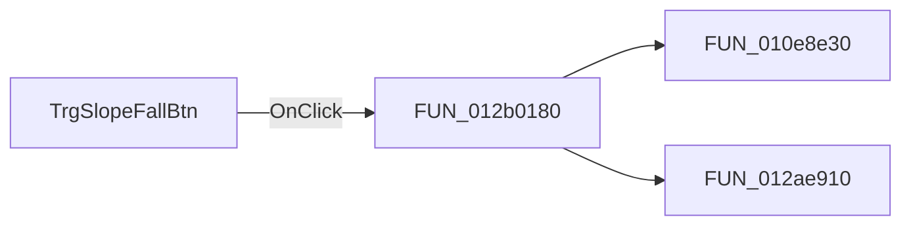

# TrgSlopeFallBtn

> Analysis status: Pending individual source review.

## Control

| Property | Recovered value |
| --- | --- |
| Form | ScopeWin |
| Component path | ScopeWin.TrgGroupBox.TrgSlopeFallBtn |
| Control class | TSpeedButton |
| Caption | Not present in the recovered resource. |
| Hint | Not present in the recovered resource. |
| Text | Not present in the recovered resource. |
| Handler name | TrgSlopeFallBtnClick |
| Handler address | 012b0180 |
| Graph node | `resource:dfm:ScopeWin/ScopeWin.TrgGroupBox.TrgSlopeFallBtn` |
| Handler node | `function:012b0180` |
| Graph layer | UI |

## What happens when clicked

Pending individual analysis. An agent must read the recovered handler source and its relevant callees before it replaces this text.

## Click flow

## Handler evidence

- Source: [DecompiledSources/Tina16/functions/00000000012B0180__FUN_012b0180.c](../../../DecompiledSources/Tina16/functions/00000000012B0180__FUN_012b0180.c)
- Recovered role: Not present in the recovered resource.
- Current graph summary: Handles 1 Delphi UI event: ScopeWin.TrgGroupBox.TrgSlopeFallBtn.OnClick.
- Current graph behavior: Not present in the recovered resource.
- Current graph evidence: Not present in the recovered resource.
- Complexity: moderate
- Distinct outgoing calls: 2

## Direct calls

- `function:010e8e30` — FUN_010e8e30
- `function:012ae910` — FUN_012ae910

## Resource evidence

- Kind: Not present in the recovered resource.
- Modal result: Not present in the recovered resource.
- Checked state: Not present in the recovered resource.
- List items: Not present in the recovered resource.
- Image reference: Not present in the recovered resource.
- Extracted glyph: [`0384_ScopeWin_ScopeWin_TrgGroupBox_TrgSlopeFallBtn_Glyph_Data.png`](../../../glyph/0384_ScopeWin_ScopeWin_TrgGroupBox_TrgSlopeFallBtn_Glyph_Data.png)

## Nearby label candidates

Nearby labels are layout candidates only. They are not proof of behavior.

- Rank 1: Level at distance 81.

## Analysis limits

- Do not infer behavior from the control class, caption, hint, glyph, or nearby label alone.
- Do not replace the pending status until the handler source and relevant call path provide enough evidence.
