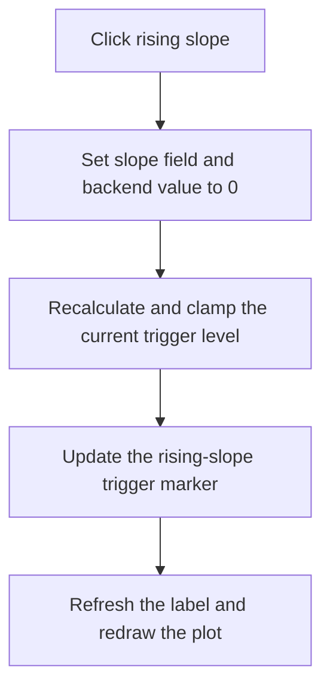

# TrgSlopeRiseBtn

> Analysis status: Recovered rising-slope state, backend update, trigger marker calculation, and redraw reviewed.

## Control

| Property | Recovered value |
| --- | --- |
| Form | ScopeWin |
| Component path | ScopeWin.TrgGroupBox.TrgSlopeRiseBtn |
| Control class | TSpeedButton |
| Caption | Not present in the recovered resource. |
| Hint | Not present in the recovered resource. |
| Text | Not present in the recovered resource. |
| Handler name | TrgSlopeRiseBtnClick |
| Handler address | 012b0130 |
| Graph node | `resource:dfm:ScopeWin/ScopeWin.TrgGroupBox.TrgSlopeRiseBtn` |
| Handler node | `function:012b0130` |
| Graph layer | UI |

## What happens when clicked

The handler stores Boolean 0 in trigger-slope field `+0xd90` and sends 0 to virtual slot `+0xe8` on the scope backend. It then recalculates the current trigger level without applying an increment, updates the trigger marker with the rising-slope flag, refreshes the trigger label, and redraws the plot.

The rising-edge glyph confirms the direction. The handler does not change trigger source, trigger mode, or the numeric level value except for normal formatting and range clamping in the shared helper.

## Click flow

## Handler evidence

- Source: [DecompiledSources/Tina16/functions/00000000012B0130__FUN_012b0130.c](../../../DecompiledSources/Tina16/functions/00000000012B0130__FUN_012b0130.c)
- Recovered role: Not present in the recovered resource.
- Current graph summary: Handles 1 Delphi UI event: ScopeWin.TrgGroupBox.TrgSlopeRiseBtn.OnClick.
- Current graph behavior: Not present in the recovered resource.
- Current graph evidence: Not present in the recovered resource.
- Complexity: moderate
- Distinct outgoing calls: 2

## Direct calls

- `function:010e8e30` — FUN_010e8e30
- `function:012ae910` — FUN_012ae910

## Resource evidence

- Kind: Not present in the recovered resource.
- Modal result: Not present in the recovered resource.
- Checked state: Not present in the recovered resource.
- List items: Not present in the recovered resource.
- Image reference: Not present in the recovered resource.
- Extracted glyph: [`0383_ScopeWin_ScopeWin_TrgGroupBox_TrgSlopeRiseBtn_Glyph_Data.png`](../../../glyph/0383_ScopeWin_ScopeWin_TrgGroupBox_TrgSlopeRiseBtn_Glyph_Data.png)

## Nearby label candidates

Nearby labels are layout candidates only. They are not proof of behavior.

- Rank 1: Level at distance 56.

## Analysis limits

- Do not infer behavior from the control class, caption, hint, glyph, or nearby label alone.
- The backend implementation and original enum name for slope value 0 are not recovered.
