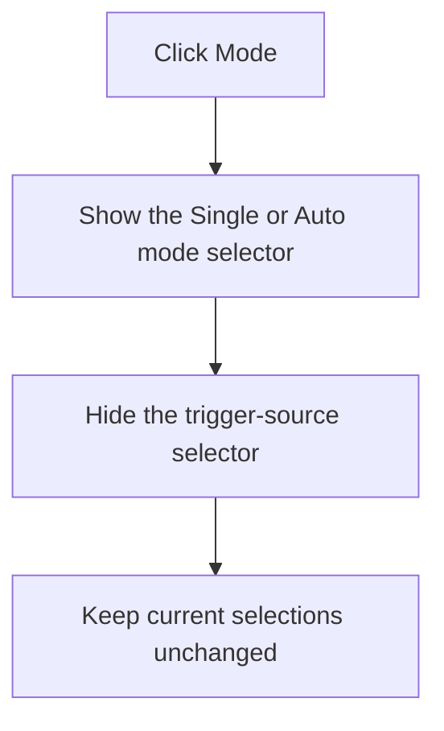

# Mode

> Analysis status: Recovered overlapping selector visibility switch reviewed.

## Control

| Property | Recovered value |
| --- | --- |
| Form | ScopeWin |
| Component path | ScopeWin.TrgGroupBox.TriggerModeBtn |
| Control class | TSpeedButton |
| Caption | Mode |
| Hint | Not present in the recovered resource. |
| Text | Not present in the recovered resource. |
| Handler name | TriggerModeBtnClick |
| Handler address | 012b13b0 |
| Graph node | `resource:dfm:ScopeWin/ScopeWin.TrgGroupBox.TriggerModeBtn` |
| Handler node | `function:012b13b0` |
| Graph layer | UI |

## What happens when clicked

The handler shows the `TriggerMode` combo box and hides the overlapping `TriggerSource` combo box. `TriggerMode` contains the resource items **Single** and **Auto**.

The click changes only which selector is visible. It does not select an item, change the backend trigger mode, or redraw the plot. Repeated clicks are effectively a no-op after these visibility states are already set.

## Click flow

## Handler evidence

- Source: [DecompiledSources/Tina16/functions/00000000012B13B0__FUN_012b13b0.c](../../../DecompiledSources/Tina16/functions/00000000012B13B0__FUN_012b13b0.c)
- Recovered role: Not present in the recovered resource.
- Current graph summary: Handles 1 Delphi UI event: ScopeWin.TrgGroupBox.TriggerModeBtn.OnClick.
- Current graph behavior: Not present in the recovered resource.
- Current graph evidence: Not present in the recovered resource.
- Complexity: simple
- Distinct outgoing calls: 1

## Direct calls

- `function:0064dbe0` — FUN_0064dbe0

## Resource evidence

- Kind: Not present in the recovered resource.
- Modal result: Not present in the recovered resource.
- Checked state: Not present in the recovered resource.
- List items: Not present in the recovered resource.
- Image reference: Not present in the recovered resource.
- Extracted glyph: None.

## Nearby label candidates

Nearby labels are layout candidates only. They are not proof of behavior.

- Rank 1: Level at distance 44.

## Analysis limits

- Do not infer behavior from the control class, caption, hint, glyph, or nearby label alone.
- The subsequent TriggerMode.OnChange handler, not this button, applies a selected mode.
