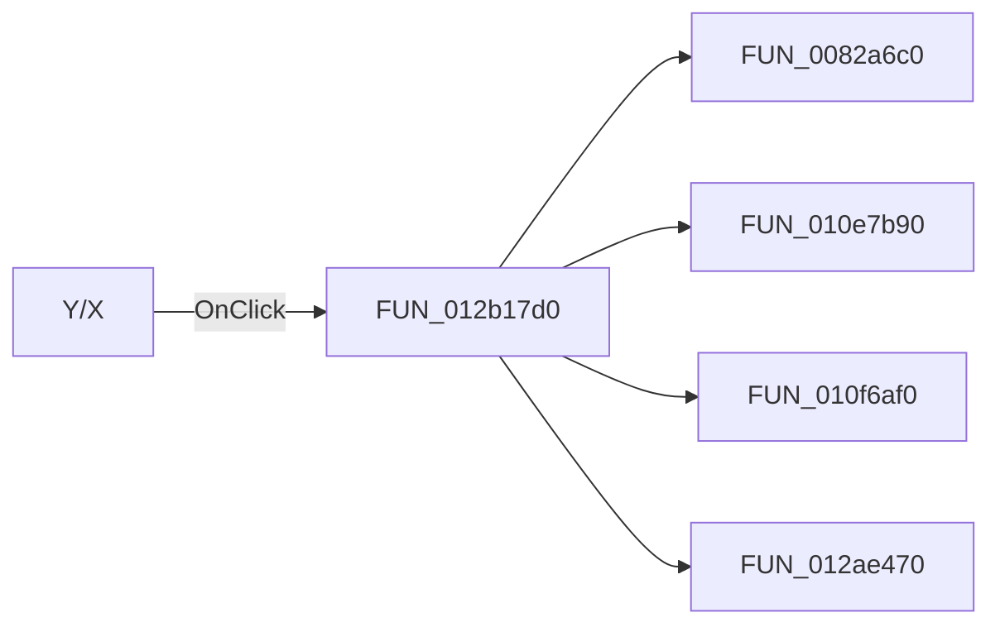

# Y/X

> Analysis status: Pending individual source review.

## Control

| Property | Recovered value |
| --- | --- |
| Form | ScopeWin |
| Component path | ScopeWin.HorizontalGroupBox.XYSpeedBtn |
| Control class | TSpeedButton |
| Caption | Y/X |
| Hint | Not present in the recovered resource. |
| Text | Not present in the recovered resource. |
| Handler name | XYSpeedBtnClick |
| Handler address | 012b17d0 |
| Graph node | `resource:dfm:ScopeWin/ScopeWin.HorizontalGroupBox.XYSpeedBtn` |
| Handler node | `function:012b17d0` |
| Graph layer | UI |

## What happens when clicked

Pending individual analysis. An agent must read the recovered handler source and its relevant callees before it replaces this text.

## Click flow

## Handler evidence

- Source: [DecompiledSources/Tina16/functions/00000000012B17D0__FUN_012b17d0.c](../../../DecompiledSources/Tina16/functions/00000000012B17D0__FUN_012b17d0.c)
- Recovered role: Not present in the recovered resource.
- Current graph summary: Handles 1 Delphi UI event: ScopeWin.HorizontalGroupBox.XYSpeedBtn.OnClick.
- Current graph behavior: Not present in the recovered resource.
- Current graph evidence: Not present in the recovered resource.
- Complexity: complex
- Distinct outgoing calls: 4

## Direct calls

- `function:0082a6c0` — FUN_0082a6c0
- `function:010e7b90` — FUN_010e7b90
- `function:010f6af0` — FUN_010f6af0
- `function:012ae470` — FUN_012ae470

## Resource evidence

- Kind: Not present in the recovered resource.
- Modal result: Not present in the recovered resource.
- Checked state: Not present in the recovered resource.
- List items: Not present in the recovered resource.
- Image reference: Not present in the recovered resource.
- Extracted glyph: None.

## Nearby label candidates

Nearby labels are layout candidates only. They are not proof of behavior.

- Rank 1: Mode at distance 51.
- Rank 2: X Source at distance 57.
- Rank 3: Position at distance 93.

## Analysis limits

- Do not infer behavior from the control class, caption, hint, glyph, or nearby label alone.
- Do not replace the pending status until the handler source and relevant call path provide enough evidence.
