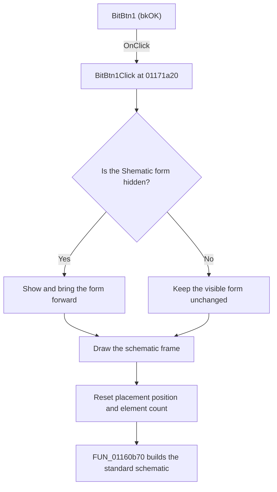

# BitBtn1

> Analysis status: Reviewed from recovered source and graph evidence.

## Control

| Property | Recovered value |
| --- | --- |
| Form | Screen_form1 |
| Component path | Screen_form1.BitBtn1 |
| Control class | TBitBtn |
| Caption | Not present in the recovered resource. |
| Hint | Not present in the recovered resource. |
| Text | Not present in the recovered resource. |
| Handler name | BitBtn1Click |
| Handler address | 01171a20 |
| Graph node | `resource:dfm:Screen_form1/Screen_form1.BitBtn1` |
| Handler node | `function:01171a20` |
| Graph layer | UI |

## What happens when clicked

The handler prepares fixed drawing bounds, makes the `Shematic` form visible when it is hidden, and reads that form's drawing rectangle. It sets the drawing color to `0x00FF0000`, draws a rectangular frame, shows and refreshes the related drawing window, and resets the shared placement position to `(24, 40)` and the shared element count to zero.

It then calls `FUN_01160b70` to build the standard schematic from the current shared model and mode. That builder clears the drawing surface, hides the `Shematic` form during construction, adds the `GENERATOR` definition, can add `TAPFESZ`, and selects either `KIMENET` or `DIVIDER` for the output path. It also dispatches model entries by their recovered type codes. The click handler does not check a result or show an error if construction fails.

## Click flow

## Handler evidence

- Source: [DecompiledSources/Tina16/functions/0000000001171A20__FUN_01171a20.c](../../../DecompiledSources/Tina16/functions/0000000001171A20__FUN_01171a20.c)
- Recovered role: Builds and displays the standard schematic.
- Current graph summary: Handles 1 Delphi UI event: Screen_form1.BitBtn1.OnClick.
- Current graph behavior: The handler prepares the schematic viewport, shows and refreshes the drawing UI, resets shared placement state, and calls the standard schematic builder.
- Current graph evidence: The handler writes the recovered bounds and placement globals, obtains the `Shematic` form's drawing rectangle, calls the color setter and rectangle helper, invokes the paired VCL show helper, and passes six shared model arguments to `FUN_01160b70`.
- Complexity: complex
- Distinct outgoing calls: 5

## Direct calls

- `function:005fdab0` — Sets the drawing color used for the frame and surface preparation.
- `function:008059a0` — Sets a VCL form visible and brings it forward.
- `function:01160b40` — The recovered `Screen_graph_form1.OnActivate` handler is an empty return.
- `function:01160b70` — Clears and builds the standard schematic from shared model data and the current mode.
- `function:011670f0` — Draws the four sides of a rectangle through drawing-surface virtual calls.

## Resource evidence

- Kind: bkOK
- Modal result: Not present in the recovered resource.
- Checked state: Not present in the recovered resource.
- List items: Not present in the recovered resource.
- Image reference: Not present in the recovered resource.
- Extracted glyph: None.

## Nearby label candidates

Nearby labels are layout candidates only. They are not proof of behavior.

- Rank 1: Rmod at distance 120.

## Analysis limits

- The recovered source does not identify the original Delphi names for the shared model arguments or placement globals.
- The handler calls drawing-surface virtual methods whose exact Delphi method names are not recovered.
- The nearby `Rmod` label is not used as evidence for this control's purpose. The separate edit handler changes a shared mode value that the downstream builder reads.
