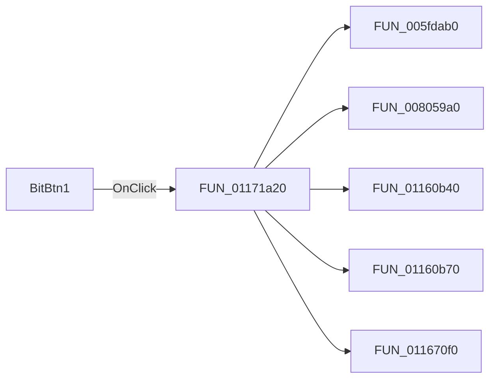

# BitBtn1

> Analysis status: Pending individual source review.

## Control

| Property | Recovered value |
| --- | --- |
| Form | Screen_form1 |
| Component path | Screen_form1.BitBtn1 |
| Control class | TBitBtn |
| Caption | Not present in the recovered resource. |
| Hint | Not present in the recovered resource. |
| Text | Not present in the recovered resource. |
| Handler name | BitBtn1Click |
| Handler address | 01171a20 |
| Graph node | `resource:dfm:Screen_form1/Screen_form1.BitBtn1` |
| Handler node | `function:01171a20` |
| Graph layer | UI |

## What happens when clicked

Pending individual analysis. An agent must read the recovered handler source and its relevant callees before it replaces this text.

## Click flow

## Handler evidence

- Source: [DecompiledSources/Tina16/functions/0000000001171A20__FUN_01171a20.c](../../../DecompiledSources/Tina16/functions/0000000001171A20__FUN_01171a20.c)
- Recovered role: Not present in the recovered resource.
- Current graph summary: Handles 1 Delphi UI event: Screen_form1.BitBtn1.OnClick.
- Current graph behavior: Not present in the recovered resource.
- Current graph evidence: Not present in the recovered resource.
- Complexity: complex
- Distinct outgoing calls: 5

## Direct calls

- `function:005fdab0` — FUN_005fdab0
- `function:008059a0` — FUN_008059a0
- `function:01160b40` — Handles 1 Delphi UI event: Screen_graph_form1.OnActivate.
- `function:01160b70` — FUN_01160b70
- `function:011670f0` — FUN_011670f0

## Resource evidence

- Kind: bkOK
- Modal result: Not present in the recovered resource.
- Checked state: Not present in the recovered resource.
- List items: Not present in the recovered resource.
- Image reference: Not present in the recovered resource.
- Extracted glyph: None.

## Nearby label candidates

Nearby labels are layout candidates only. They are not proof of behavior.

- Rank 1: Rmod at distance 120.

## Analysis limits

- Do not infer behavior from the control class, caption, hint, glyph, or nearby label alone.
- Do not replace the pending status until the handler source and relevant call path provide enough evidence.
