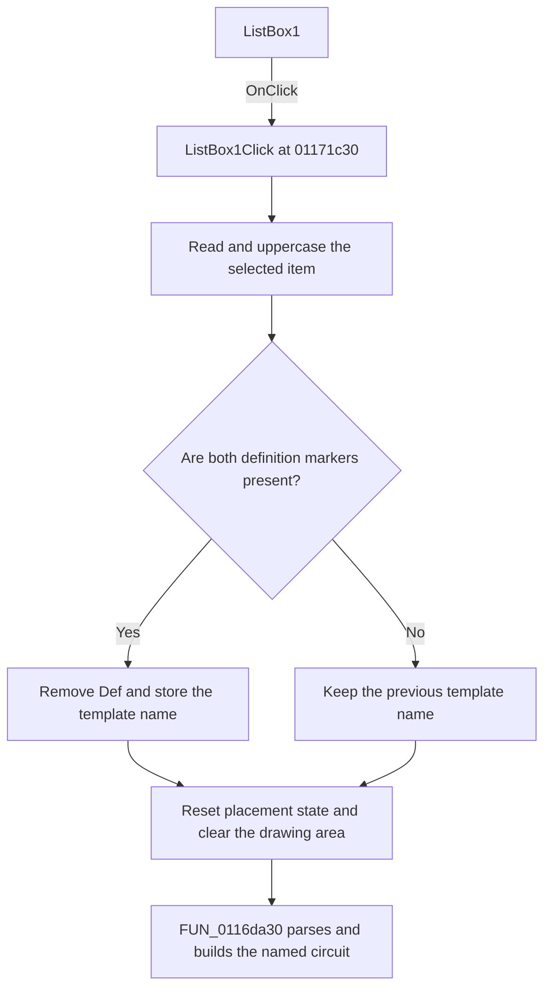

# ListBox1

> Analysis status: Reviewed from recovered source and graph evidence.

## Control

| Property | Recovered value |
| --- | --- |
| Form | Screen_form1 |
| Component path | Screen_form1.ListBox1 |
| Control class | TListBox |
| Caption | Not present in the recovered resource. |
| Hint | Not present in the recovered resource. |
| Text | Not present in the recovered resource. |
| Handler name | ListBox1Click |
| Handler address | 01171c30 |
| Graph node | `resource:dfm:Screen_form1/Screen_form1.ListBox1` |
| Handler node | `function:01171c30` |
| Graph layer | UI |

## What happens when clicked

The handler reads the selected list item and converts it to uppercase. If the line contains both `PROCEDURE` and `{_JO }`, it locates the recovered name delimiters and removes the three-character `Def` prefix. The resulting template name is stored in shared state. For example, the embedded `PROCEDURE DefLowPassFilter; {_JO }` entry supplies the `LOWPASSFILTER` template name.

The handler then resets the shared placement position to `(24, 40)` and the shared element count to zero, makes the `Shematic` form visible when needed, clears its drawing rectangle with color value `0x00FF0000`, and calls `FUN_0116da30`. That callee finds the named procedure block in the embedded definition library, reads its node and element declarations, and creates the listed circuit elements. Recovered commands include conductive, capacitive, and inductive branches, generators, outputs, and operational-amplifier elements.

If the selected line lacks `PROCEDURE` or `{_JO }`, the handler does not replace the stored template name. It still redraws and calls the builder with the previous value. The handler also has no recovered check for an invalid item index, a missing end delimiter, or the builder's result.

## Click flow

## Handler evidence

- Source: [DecompiledSources/Tina16/functions/0000000001171C30__FUN_01171c30.c](../../../DecompiledSources/Tina16/functions/0000000001171C30__FUN_01171c30.c)
- Recovered role: Extracts the selected definition name and builds its circuit schematic.
- Current graph summary: Handles 1 Delphi UI event: Screen_form1.ListBox1.OnClick.
- Current graph behavior: The handler derives a template name from a selected `PROCEDURE Def...` entry, resets the drawing state, and invokes the circuit-definition parser and builder.
- Current graph evidence: The handler obtains the list item by its selected index, calls the uppercase, substring-search, and substring-copy helpers, stores the recovered template name, prepares the `Shematic` drawing surface, and passes that name to `FUN_0116da30`.
- Complexity: complex
- Distinct outgoing calls: 9

## Direct calls

- `function:00414560` — Delphi UnicodeString array finalization helper
- `function:00414ad0` — Delphi UnicodeString assignment helper
- `function:00416dc0` — Copies a bounded substring into the shared template-name string.
- `function:004170c0` — Searches a Unicode string from a one-based start position.
- `function:0043e130` — Creates an uppercase copy of the selected list item.
- `function:005fdab0` — Sets the drawing color used to clear the schematic rectangle.
- `function:008059a0` — Sets a VCL form visible and brings it forward.
- `function:01160b40` — The recovered `Screen_graph_form1.OnActivate` handler is an empty return.
- `function:0116da30` — Parses the named procedure block and creates its declared circuit nodes and elements.

## Resource evidence

- Kind: Not present in the recovered resource.
- Modal result: Not present in the recovered resource.
- Checked state: Not present in the recovered resource.
- List items: ("" (utf-16, 0 bytes), "PROCEDURE DefLowPassFilter;                     {_JO }", "     GNDb0=0;{_X14 Y18 GND}", "     Inpp1=1;{_X0 Y7 Ube}", "     Outp2=2;{_X25 Y7 Uki}", "     Vccm3=3;{_X17 Y4 V+}", "     Vccp4=4;{_X17 Y10 V-}", "     Bn5=5;{_X6 Y5 }", "     Bn6=6;{_X11 Y5 }", "     Bn7=7;{_X14 Y12 }", "     jbn1       !_X11 Y18", "     jbn2       !_X22 Y7", "     jbn3       !_X25 Y7", "          Nofs := DefineInnerNodes(3);", "          Eofs := DefineElements(7);", "CreateConductiveBranch(Eofs+1,Inpp1,Nofs+Bn5,linear);   {_X0 Y7 I0 R1 }", "CreateConductiveBranch(Eofs+2,Nofs+Bn5,Nofs+Bn6,linear);{_X6 Y5 I0 R2 }", "CreateConductiveBranch(Eofs+3,Nofs+Bn7,gndb0,linear);   {_X14 Y13 I1 RA }", "CreateConductiveBranch(Eofs+4,Nofs+Bn7,outp2,linear);   {_X16 Y12 I0 RB } {jbn 2 }", "CreateCapacitiveBranch(Eofs+5,Nofs+Bn5,outp2,linear);   {_X14 Y1 I0 C1 }  ( jbn 3 }", "CreateCapacitiveBranch(Eofs+6,Nofs+Bn6,gndb0,linear);   {_X11 Y7 I1 C2 }", "CallStdOpAmpDef_Ok (Nofs+Bn6, Nofs+Bn7, Outp2,          {_X18 Y7 I2 } ( jbn3  }", "          Vccp4, Vccm3, MainAttrs, attrs, opampwrk1);", " {_PROCVEG }", "" (utf-16, 0 bytes), "" (utf-16, 0 bytes), "PROCEDURE DefLowPassFilter1;                     {_JO }", "     GNDb0=0;{_X8 Y18 GND}", "     Inpp1=1;{_X0 Y7 Ube}", "     Outp2=2;{_X21 Y7 Uki}", "     Vccm3=3;{_X14 Y4 V+}", "     Vccp4=4;{_X14 Y10 V-}", "     Bn5=5;{_X8 Y7 }", "     Bn6=6;{_X11 Y12 }", "     jbn1       !_X19 Y7", "     jbn2       !_X21 Y7", "          Nofs := DefineInnerNodes(2);", "          Eofs := DefineElements(4);", "CreateConductiveBranch(Eofs+1,Inpp1,Nofs+Bn5,linear); {_X0 Y7 I0 R1 }", "CreateCapacitiveBranch(Eofs+2,Nofs+Bn5,gndb0,linear); {_X8 Y9 I1 C1 }", "CreateVezetekOP(Eofs+3,Nofs+bn6,Outp2,linear);        {_X14 Y12 I0 V ) { JBN 1 }", "CallStdOpAmpDef_Ok (Nofs+Bn5, Nofs+Bn6, Outp2,        {_X15 Y7 I2 } (jbn2  }", "          Vccp4, Vccm3, MainAttrs, attrs, opampwrk1);", " {_PROCVEG }", "" (utf-16, 0 bytes), "" (utf-16, 0 bytes), "PROCEDURE DefHighPassFilter;                     {_JO }", "     GNDb0=0;{_X14 Y18 GND}", "     Inpp1=1;{_X0 Y7 Ube}", "     Outp2=2;{_X25 Y7 Uki}", "     Vccm3=3;{_X17 Y4 V+}", "     Vccp4=4;{_X17 Y10 V-}", "     Bn5=5;{_X6 Y5 }", "     Bn6=6;{_X11 Y5 }", "     Bn7=7;{_X14 Y12 }", "     jbn1       !_X11 Y18", "     jbn2       !_X22 Y7", "     jbn3       !_X25 Y7", "          Nofs := DefineInnerNodes(3);", "          Eofs := DefineElements(7);", "CreateCapacitiveBranch(Eofs+1,Inpp1,Nofs+Bn5,linear);   {_X0 Y7 I0 C1 }", "CreateCapacitiveBranch(Eofs+2,Nofs+Bn5,Nofs+Bn6,linear);{_X6 Y5 I0 C2 }", "CreateConductiveBranch(Eofs+3,Nofs+Bn7,gndb0,linear);   {_X14 Y13 I1 RA }", "CreateConductiveBranch(Eofs+4,Nofs+Bn7,outp2,linear);   {_X16 Y12 I0 RB } {jbn 2 }", "CreateConductiveBranch(Eofs+5,Nofs+Bn5,outp2,linear);   {_X14 Y1 I0 R1 }  ( jbn 3 }", "CreateConductiveBranch(Eofs+6,Nofs+Bn6,gndb0,linear);   {_X11 Y7 I1 R2 }", "CallStdOpAmpDef_Ok (Nofs+Bn6, Nofs+Bn7, Outp2,          {_X18 Y7 I2 } (jbn3  }", "          Vccp4, Vccm3, MainAttrs, attrs, opampwrk1);", " {_PROCVEG }", "" (utf-16, 0 bytes), "" (utf-16, 0 bytes), "PROCEDURE DefHighPassFilter1;                     {_JO }", "     GNDb0=0;{_X8 Y18 GND}", "     Inpp1=1;{_X0 Y7 Ube}", "     Outp2=2;{_X21 Y7 Uki}", "     Vccm3=3;{_X14 Y4 V+}", "     Vccp4=4;{_X14 Y10 V-}", "     Bn5=5;{_X8 Y7 }", "     Bn6=6;{_X11 Y12 }", "     jbn1       !_X19 Y7", "     jbn2       !_X21 Y7", "          Nofs := DefineInnerNodes(2);", "          Eofs := DefineElements(4);", "CreateCapacitiveBranch(Eofs+1,Inpp1,Nofs+Bn5,linear);{_X0 Y7 I0 C1 }", "CreateConductiveBranch(Eofs+2,Nofs+Bn5,gndb0,linear);{_X8 Y9 I1 R1 }", "CreateVezetekOP(Eofs+3,Nofs+bn6,Outp2,linear);         {_X14 Y12 I0 V ) { JBN 1 }", "CallStdOpAmpDef_Ok (Nofs+Bn5, Nofs+Bn6, Outp2,        {_X15 Y7 I2 } (jbn2  }", "          Vccp4, Vccm3, MainAttrs, attrs, opampwrk1);", " {_PROCVEG }", "" (utf-16, 0 bytes), "" (utf-16, 0 bytes), "PROCEDURE DefBandPassFilter;                     {_JO }", "     GNDb0=0;{_X15 Y18 GND}", "     Inpp1=1;{_X0 Y7 Ube}", "     Outp2=2;{_X26 Y7 Uki}", "     Vccm3=3;{_X18 Y4 V+}", "     Vccp4=4;{_X18 Y10 V-}", "     Bn5=5;{_X7 Y5 }", "     Bn6=6;{_X12 Y5 }", "     Bn7=7;{_X15 Y12 }", "     jbn1       !_X12 Y18", "     jbn2       !_X23 Y7", "     jbn3       !_X26 Y7", "          Nofs := DefineInnerNodes(3);", "          Eofs := DefineElements(8);", "CreateConductiveBranch(Eofs+1,Inpp1,Nofs+Bn5,linear);{_X0 Y7 I0 R1 }", "CreateCapacitiveBranch(Eofs+2,Nofs+Bn5,Nofs+Bn6,linear);{_X7 Y5 I0 C2 }", "CreateConductiveBranch(Eofs+3,Nofs+Bn7,gndb0,linear);{_X15 Y13 I1 RA }", "CreateConductiveBranch(Eofs+4,Nofs+Bn7,outp2,linear);{_X17 Y12 I0 RB } {jbn 2 }", "CreateConductiveBranch(Eofs+5,Nofs+Bn5,outp2,linear);{_X15 Y1 I0 R2 }  ( jbn 3 }", "CreateCapacitiveBranch(Eofs+7,Nofs+Bn5,gndb0,linear);{_X7 Y9 I1 C1 }", "CreateConductiveBranch(Eofs+6,Nofs+Bn6,gndb0,linear);{_X12 Y7 I1 R3 }   {jbn 1 }", "CallStdOpAmpDef_Ok (Nofs+Bn6, Nofs+Bn7, Outp2,        {_X19 Y7 I2 } (jbn3  }", "          Vccp4, Vccm3, MainAttrs, attrs, opampwrk1);", " {_PROCVEG }", "" (utf-16, 0 bytes), "" (utf-16, 0 bytes), "PROCEDURE DefBandStopFilter;                     {_JO }", "     GNDb0=0;{_X15 Y18 GND}", "     Inpp1=1;{_X0 Y7 Ube}", "     Outp2=2;{_X26 Y7 Uki}", "     Vccm3=3;{_X18 Y4 V+}", "     Vccp4=4;{_X18 Y10 V-}", "     Bn5=5;{_X7 Y5 }", "     Bn6=6;{_X12 Y5 }", "     Bn7=7;{_X15 Y12 }", "     Bn8=8;{_X7 Y9 }", "     jbn1       !_X12 Y18", "     jbn2       !_X23 Y7", "     jbn3       !_X26 Y7", "          Nofs := DefineInnerNodes(4);", "          Eofs := DefineElements(10);", "CreateCapacitiveBranch(Eofs+1,Inpp1,Nofs+Bn5,linear);   {_X0 Y5 I0 C1 }", "CreateCapacitiveBranch(Eofs+2,Nofs+Bn5,Nofs+Bn6,linear);{_X7 Y5 I0 C2 }", "CreateConductiveBranch(Eofs+3,Inpp1,Nofs+Bn8,linear);   {_X0 Y9 I0 R1 }", "CreateConductiveBranch(Eofs+4,Nofs+Bn8,Nofs+Bn6,linear);{_X7 Y9 I0 R2 }", "CreateConductiveBranch(Eofs+5,Nofs+Bn7,gndb0,linear);{_X15 Y13 I1 RA }", "CreateConductiveBranch(Eofs+6,Nofs+Bn7,outp2,linear);{_X17 Y12 I0 RB } {jbn 2 }", "CreateConductiveBranch(Eofs+7,Nofs+Bn5,outp2,linear);{_X15 Y1 I0 R/2 }  ( jbn 3 }", "CreateCapacitiveBranch(Eofs+8,Nofs+Bn8,gndb0,linear);{_X7 Y10 I1 2C }", "CreateConductiveBranch(Eofs+9,Nofs+Bn6,gndb0,linear);{_X12 Y10 I1 Y }  {jbn 1 }", "CallStdOpAmpDef_Ok (Nofs+Bn6, Nofs+Bn7, Outp2,        {_X19 Y7 I2 } (jbn3  }", "          Vccp4, Vccm3, MainAttrs, attrs, opampwrk1);", " {_PROCVEG }", "" (utf-16, 0 bytes), "" (utf-16, 0 bytes), "PROCEDURE DefDivider;                     {_JO }", "     GNDb0=0;{_X10 Y18 GND}", "     Inpp1=1;{_X0 Y7 Ube}", "     Outp2=2;{_X11 Y7 Uki}", "     Bn3=3; {_X10 Y7 }", "          Nofs := DefineInnerNodes(1);", "          Eofs := DefineElements(3);", "CreateConductiveBranch(Eofs+1,Inpp1,outp2,linear);{_X3 Y7 I0 RX}", "CreateConductiveBranch(Eofs+2,Nofs+bn3,gndb0,linear);{_X10 Y9 I1 RY}", "CREATEKIMENET(Eofs+3,Outp2,inp1) {_X11 Y7 I0 Out }", " {_PROCVEG }", "" (utf-16, 0 bytes), "" (utf-16, 0 bytes), "PROCEDURE DefKIMENET;                     {_JO }", "     ", "     Inpp1=1;{_X0 Y7 Ube}", "     Outp2=2;{_X1 Y7 Uki}", "     Bn3=3; {_X5 Y7 }", "          Nofs := DefineInnerNodes(1);", "          Eofs := DefineElements(1);", "CREATEKIMENET(Eofs+3,Outp2,inp1,linear) {_X0 Y7 I0 Out }", " {_PROCVEG }", "" (utf-16, 0 bytes), "" (utf-16, 0 bytes), "PROCEDURE DefGENERATOR;                     {_JO }", "     GNDb0=0;{_X1 Y14 GND}", "     Outp1=1;{_X4 Y7 U+}", "     Bn3=3; {_X1 Y7 }", "          Nofs := DefineInnerNodes(2);", "          Eofs := DefineElements(1);", "CreateVoltageGenerator(EOfs+3,Gndb0,outp1,linear); {_X1 Y8 I1 U0}", " {_PROCVEG }", "" (utf-16, 0 bytes), "PROCEDURE DefTAPFESZ;                     {_JO }", "     GNDb0=0;{_X2 Y12 GND} {GNDF}", "     Outp1=1;{_X2 Y2 U+}", "     Outp2=2;{_X2 Y20 U-}", "     Bn3=3; {_X10 Y5 }", "          Nofs := DefineInnerNodes(2);", "          Eofs := DefineElements(2);", "CREATEtapgenerator(Eofs+1,Outp1,gndb0,linear); {_X2 Y6 I1 V+} ", "CREATEtapgenerator(Eofs+2,gndb0,Outp2,linear); {_X2 Y13 I1 V-} ", " {_PROCVEG }", "" (utf-16, 0 bytes), "PROCEDURE DefPARALELL_R;                     {_JO }", "     GNDb0=0;{_X2 Y18 GND}", "     Inpp1=1;{_X0 Y7 Ube}", "     Outp2=2;{_X4 Y7 Uki}", "     Bn3=3;  {_X4 Y7 }", "     jbn1       !_X2 Y7", "     Nofs := DefineInnerNodes(1);", "     Eofs := DefineElements(2);", "CreateConductiveBranch(Eofs+1,Inpp1,GNDb0,linear);{_X2 Y9 I1 R }", "CreateVezetekOP(Eofs+2,Nofs+bn3,Outp2,linear);   {_X4 Y7 I0 V ) { JBN 1 }", "{_PROCVEG }", "" (utf-16, 0 bytes), "" (utf-16, 0 bytes), "PROCEDURE DefSERIAL_R;                     {_JO }", "     Inpp1=1;{_X0 Y7 Ube}", "     Outp2=2;{_X8 Y7 Uki}", "     Nofs := DefineInnerNodes(1);", "     Eofs := DefineElements(1);", "CreateConductiveBranch(Eofs+1,Inpp1,Outp2,linear); {_X2 Y7 I0 R }", "{_PROCVEG }", "" (utf-16, 0 bytes), "" (utf-16, 0 bytes), "" (utf-16, 0 bytes), "" (utf-16, 0 bytes), "PROCEDURE DefPARALELL_C;                     {_JO }", "     GNDb0=0;{_X2 Y18 GND}", "     Inpp1=1;{_X0 Y7 Ube}", "     Outp2=2;{_X4 Y7 Uki}", "     Bn3=3;  {_X4 Y7 }", "     jbn1       !_X2 Y7", "     Nofs := DefineInnerNodes(1);", "     Eofs := DefineElements(2);", "CreateCapacitiveBranch(Eofs+1,Inpp1,GNDb0,linear);{_X2 Y9 I1 C }", "CreateVezetekOP(Eofs+2,Nofs+bn3,Outp2,linear);   {_X4 Y7 I0 V ) { JBN 1 }", "{_PROCVEG }", "" (utf-16, 0 bytes), "" (utf-16, 0 bytes), "PROCEDURE DefSERIAL_C;                     {_JO }", "     Inpp1=1;{_X0 Y7 Ube}", "     Outp2=2;{_X8 Y7 Uki}", "     Nofs := DefineInnerNodes(1);", "     Eofs := DefineElements(1);", "CreateCapacitiveBranch(Eofs+1,Inpp1,Outp2,linear);{_X2 Y7 I0 C }", "{_PROCVEG }", "" (utf-16, 0 bytes), "" (utf-16, 0 bytes), "PROCEDURE DefPARALELL_L;                     {_JO }", "     GNDb0=0;{_X2 Y18 GND}", "     Inpp1=1;{_X0 Y7 Ube}", "     Outp2=2;{_X4 Y7 Uki}", "     Bn3=3;{_X4 Y7 }", "     jbn1       !_X2 Y7", "     Nofs := DefineInnerNodes(1);", "     Eofs := DefineElements(2);", "CreateInductiveBranch(Eofs+1,Inpp1,GNDb0,linear); {_X2 Y9 I1 L }", "CreateVezetekOP(Eofs+2,Nofs+bn3,Outp2,linear);  {_X4 Y7 I0 V ) { JBN 1 }", "" (utf-16, 0 bytes), "{_PROCVEG }", "" (utf-16, 0 bytes), "" (utf-16, 0 bytes), "PROCEDURE DefSERIAL_L;                     {_JO }", "     Inpp1=1;{_X0 Y7 Ube}", "     Outp2=2;{_X8 Y7 Uki}", "     Nofs := DefineInnerNodes(1);", "     Eofs := DefineElements(1);", "CreateInductiveBranch(Eofs+1,Inpp1,Outp2,linear); {_X2 Y7 I0 L }", "{_PROCVEG }", "" (utf-16, 0 bytes), "" (utf-16, 0 bytes), "PROCEDURE DefPARALELL_LC;                     {_JO }", "     GNDb0=0;{_X2 Y22 GND}", "     Inpp1=1;{_X0 Y7 Ube}", "     Outp2=2;{_X4 Y7 Uki}", "     Bn3=3;{_X4 Y7 }", "     Bn4=4;{_X4 Y11 }", "     jbn1       !_X2 Y7", "     Nofs := DefineInnerNodes(2);", "     Eofs := DefineElements(3);", "CreateInductiveBranch(Eofs+1,Inpp1,Bn4,linear); {_X2 Y9 I1 L }", "CreateCapacitiveBranch(Eofs+2,Bn4,GNDb0,linear); {_X2 Y15 I1 C }", "CreateVezetekOP(Eofs+3,Nofs+bn3,Outp2,linear);  {_X4 Y7 I0 V ) { JBN 1 }", "" (utf-16, 0 bytes), "{_PROCVEG }", "" (utf-16, 0 bytes), "" (utf-16, 0 bytes), "PROCEDURE DefPARALELL_LC_regi;                     {_JO }", "     GNDb0=0;{_X2 Y18 GND}", "     Inpp1=1;{_X0 Y7 Ube}", "     Outp2=2;{_X4 Y7 Uki}", "     Bn3=3;{_X4 Y7 }", "     Bn4=4;{_X4 Y11 }", "     jbn1       !_X2 Y7", "     Nofs := DefineInnerNodes(2);", "     Eofs := DefineElements(3);", "CreateInductiveBranch(Eofs+1,Inpp1,Bn4,linear); {_X2 Y9 I1 L }", "CreateCapacitiveBranch(Eofs+2,Bn4,GNDb0,linear); {_X2 Y13 I1 C }", "CreateVezetekOP(Eofs+3,Nofs+bn3,Outp2,linear);  {_X4 Y7 I0 V ) { JBN 1 }", "" (utf-16, 0 bytes), "{_PROCVEG }", "" (utf-16, 0 bytes), "" (utf-16, 0 bytes), "PROCEDURE DefSERIAL_LC;                     {_JO }", "     Inpp1=1;{_X0 Y7 Ube}", "     Outp2=2;{_X12 Y7 Uki}", "     Bn3=3;{_X5 Y7 }", "     Nofs := DefineInnerNodes(2);", "     Eofs := DefineElements(2);", "CreateInductiveBranch(Eofs+1,Inpp1,Bn3,linear); {_X1 Y7 I0 L }", "CreateCapacitiveBranch(Eofs+2,Bn3,Outp2,linear); {_X7 Y7 I0 C }", "{_PROCVEG }", "" (utf-16, 0 bytes), "PROCEDURE DefPARALELL_LxC;                     {_JO }", "     GNDb0=0;{_X2 Y18 GND}", "     Inpp1=1;{_X0 Y7 Ube}", "     Outp2=2;{_X8 Y7 Uki}", "     Bn3=3;{_X2 Y7 }", "     Bn4=4;{_X6 Y7 }", "     jbn1       !_X6 Y7", "     jbn2       !_X6 Y18", "     Nofs := DefineInnerNodes(3);", "     Eofs := DefineElements(3);", "CreateCapacitiveBranch(Eofs+2,Inpp1,Gndb0,linear); {_X2 Y9 I1 C }", "CreateInductiveBranch(Eofs+1,Nofs+Bn3,Gndb0,linear); {_X6 Y9 I1 L }", "CreateVezetekOP(Eofs+3,Nofs+bn4,Outp2,linear);  {_X8 Y7 I0 V )", "" (utf-16, 0 bytes), "{_PROCVEG }", "" (utf-16, 0 bytes), "" (utf-16, 0 bytes), "PROCEDURE DefSERIAL_LxC;                     {_JO }", "     Inpp1=1;{_X0 Y7 Ube}", "     Outp2=2;{_X10 Y7 Uki}", "     Bn3=3;{_X1 Y7 }", "     Bn4=4;{_X8 Y7 }", "     jbn1       !_X1 Y7", "     jbn2       !_X8 Y7", "     Nofs := DefineInnerNodes(2);", "     Eofs := DefineElements(3);", "CreateInductiveBranch(Eofs+1,Inpp1,BN4,linear); {_X2 Y5 I0 L }  { jbn1 }", "CreateCapacitiveBranch(Eofs+2,Nofs+bn3,Outp2,linear); {_X2 Y9 I0 C } {jbn 2 }", "CreateVezetekOP(Eofs+3,Nofs+bn4,Outp2,linear);  {_X9 Y7 I0 V )", "" (utf-16, 0 bytes), "{_PROCVEG }", "" (utf-16, 0 bytes), "PROCEDURE DefPARALELL_LC_LxC;                     {_JO }", "     GNDb0=0;{_X4 Y23 GND}", "     Inpp1=1;{_X0 Y7 Ube}", "     Outp2=2;{_X8 Y7 Uki}", "     Bn3=3;{_X4 Y7 }", "     Bn4=4;{_X4 Y12 }", "     Bn5=5;{_X4 Y17 }", "     jbn1       !_X8 Y7", "     Nofs := DefineInnerNodes(6);", "     Eofs := DefineElements(5);", "CreateInductiveBranch(Eofs+1,Inpp1,Nofs+Bn4,linear); {_X4 Y7 I1 L }", "CreateCapacitiveBranch(Eofs+2,Bn4,Nofs+Bn5,linear); {_X4 Y12 I1 C }", "CreateCapacitiveBranch(Eofs+4,Nofs+Bn5,Gndb0,linear); {_X2 Y18 I1 CP }", "CreateInductiveBranch(Eofs+3,Nofs+Bn5,Gndb0,linear); {_X6 Y18 I1 LP }", "CreateVezetekOP(Eofs+5,Nofs+Bn3,Outp2,linear);  {_X6 Y7 I0 V ) { JBN 1 }", "" (utf-16, 0 bytes), "{_PROCVEG }", "" (utf-16, 0 bytes), "" (utf-16, 0 bytes), "" (utf-16, 0 bytes), "" (utf-16, 0 bytes), " ", " ", " ", " ", " ", " ", " ", " ", " ", " ", " ", " ", " ", " ", " ", " ", " ", " ", " ", " ", " ", " ", " ", " ", " ", " ", " ", " ")
- Image reference: Not present in the recovered resource.
- Extracted glyph: None.

## Nearby label candidates

Nearby labels are layout candidates only. They are not proof of behavior.

- Rank 1: Rmod at distance 56.

## Analysis limits

- The exact text of three static delimiter constants is not present in the recovered C source. Their positions and the three-character skip establish the name extraction, and the embedded `Def...` procedure declarations confirm the input format.
- The drawing-surface virtual method names and the original Delphi names for shared state are not recovered.
- The nearby `Rmod` label is not used as evidence for this list's behavior.
