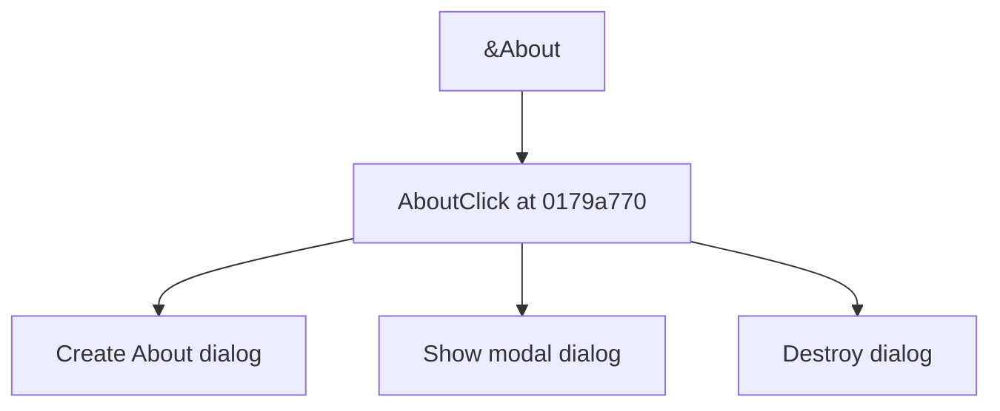

# &About

> Analysis status: Source reviewed for TIARA-diz.6.7.1542.

## Control

| Property | Recovered value |
| --- | --- |
| Form | ShapeEdit |
| Component path | ShapeEdit.MainMenu.Help.About |
| Control class | TMenuItem |
| Caption | &About |
| Hint | Not present in the recovered resource. |
| Handler name | AboutClick |
| Handler address | 0179a770 |
| Graph node | `resource:dfm:ShapeEdit/ShapeEdit.MainMenu.Help.About` |
| Handler node | `function:0179a770` |

## What happens when clicked

Creates the recovered About dialog, shows it modally, and destroys it after the dialog closes.

## Click flow

## Evidence

- Handler source: [000000000179A770__FUN_0179a770.c](../../../DecompiledSources/Tina16/functions/000000000179A770__FUN_0179a770.c)
- Extracted glyph: None.
- Recovered path: The handler constructs class 01781d28, calls its modal-show path, and releases the dialog in the cleanup path.
- Resource context: The recovered TMenuItem resource uses caption `&About`.

## Analysis limits

- No additional implementation gap was found in the recovered click path.
- The caption, hint, and glyph support control identity only. They do not replace the recovered handler and callee evidence.

