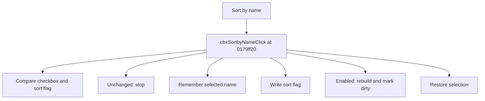

# Sort by name

> Analysis status: Source reviewed for TIARA-diz.6.7.1586.

## Control

| Property | Recovered value |
| --- | --- |
| Form | ShapeEdit |
| Component path | ShapeEdit.TemplatePanel.cbxSortbyName |
| Control class | TCheckBox |
| Caption | Sort by name |
| Hint | Not present in the recovered resource. |
| Handler name | cbxSortbyNameClick |
| Handler address | 0179ff20 |
| Graph node | `resource:dfm:ShapeEdit/ShapeEdit.TemplatePanel.cbxSortbyName` |
| Handler node | `function:0179ff20` |

## What happens when clicked

Compares the checkbox state with the library sort flag and stops if they match. Otherwise it remembers the selected device name, writes the new sort flag, and restores selection by name. When sorting is enabled, it also rebuilds the list and marks the document dirty. The recovered handler does not rebuild or set dirty when sorting is disabled.

## Click flow

## Evidence

- Handler source: [000000000179FF20__FUN_0179ff20.c](../../../DecompiledSources/Tina16/functions/000000000179FF20__FUN_0179ff20.c)
- Extracted glyph: None.
- Recovered path: The handler reads field +0xc38 and library field +0x48, stores the selected name, writes the flag, conditionally calls 01798270 and 01795670 only on the true state, finds the saved name, and updates selection when its index changes.
- Resource context: The recovered TCheckBox resource uses caption `Sort by name`.

## Analysis limits

- The asymmetric disable branch is explicit in the recovered source; its broader persistence intent is unknown.
- The caption, hint, and glyph support control identity only. They do not replace the recovered handler and callee evidence.

