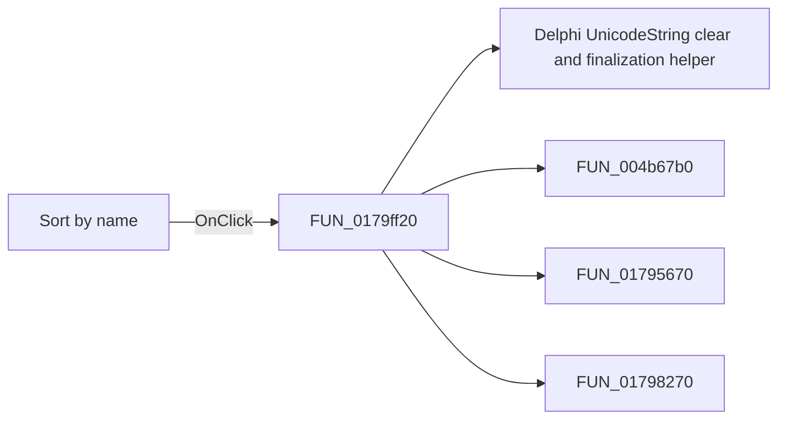

# Sort by name

> Analysis status: Pending individual source review.

## Control

| Property | Recovered value |
| --- | --- |
| Form | ShapeEdit |
| Component path | ShapeEdit.TemplatePanel.cbxSortbyName |
| Control class | TCheckBox |
| Caption | Sort by name |
| Hint | Not present in the recovered resource. |
| Text | Not present in the recovered resource. |
| Handler name | cbxSortbyNameClick |
| Handler address | 0179ff20 |
| Graph node | `resource:dfm:ShapeEdit/ShapeEdit.TemplatePanel.cbxSortbyName` |
| Handler node | `function:0179ff20` |
| Graph layer | UI |

## What happens when clicked

Pending individual analysis. An agent must read the recovered handler source and its relevant callees before it replaces this text.

## Click flow

## Handler evidence

- Source: [DecompiledSources/Tina16/functions/000000000179FF20__FUN_0179ff20.c](../../../DecompiledSources/Tina16/functions/000000000179FF20__FUN_0179ff20.c)
- Recovered role: Not present in the recovered resource.
- Current graph summary: Handles 1 Delphi UI event: ShapeEdit.TemplatePanel.cbxSortbyName.OnClick.
- Current graph behavior: Not present in the recovered resource.
- Current graph evidence: Not present in the recovered resource.
- Complexity: complex
- Distinct outgoing calls: 4

## Direct calls

- `function:00414480` — Delphi UnicodeString clear and finalization helper
- `function:004b67b0` — FUN_004b67b0
- `function:01795670` — FUN_01795670
- `function:01798270` — FUN_01798270

## Resource evidence

- Kind: Not present in the recovered resource.
- Modal result: Not present in the recovered resource.
- Checked state: Not present in the recovered resource.
- List items: Not present in the recovered resource.
- Image reference: Not present in the recovered resource.
- Extracted glyph: None.

## Nearby label candidates

Nearby labels are layout candidates only. They are not proof of behavior.

- No same-parent label candidate is available.

## Analysis limits

- Do not infer behavior from the control class, caption, hint, glyph, or nearby label alone.
- Do not replace the pending status until the handler source and relevant call path provide enough evidence.
