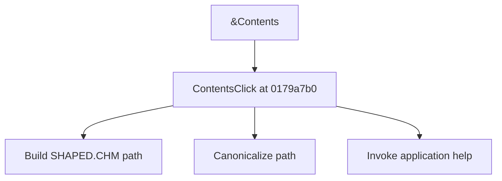

# &Contents

> Analysis status: Source reviewed for TIARA-diz.6.7.1543.

## Control

| Property | Recovered value |
| --- | --- |
| Form | ShapeEdit |
| Component path | ShapeEdit.MainMenu.Help.Contents |
| Control class | TMenuItem |
| Caption | &Contents |
| Hint | Not present in the recovered resource. |
| Handler name | ContentsClick |
| Handler address | 0179a7b0 |
| Graph node | `resource:dfm:ShapeEdit/ShapeEdit.MainMenu.Help.Contents` |
| Handler node | `function:0179a7b0` |

## What happens when clicked

Builds the SHAPED.CHM path under the application's recovered base directory, canonicalizes the path, and sends it to the application help system with help command 3.

## Click flow

## Evidence

- Handler source: [000000000179A7B0__FUN_0179a7b0.c](../../../DecompiledSources/Tina16/functions/000000000179A7B0__FUN_0179a7b0.c)
- Extracted glyph: None.
- Recovered path: The handler appends SHAPED.CHM to form field +0xcc0, calls 01b1def0, and invokes the application help object through its recovered virtual method.
- Resource context: The recovered TMenuItem resource uses caption `&Contents`.

## Analysis limits

- The recovered handler has no local error or missing-file branch.
- The caption, hint, and glyph support control identity only. They do not replace the recovered handler and callee evidence.

