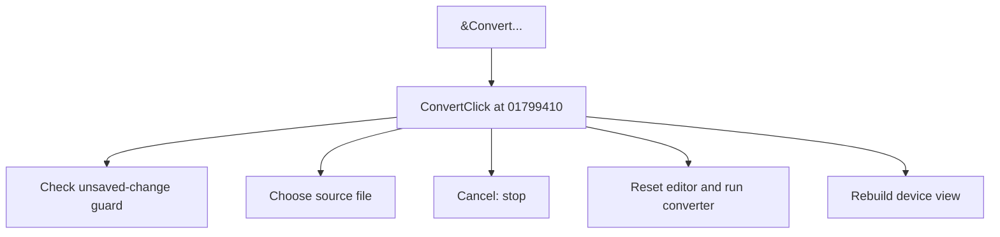

# &Convert...

> Analysis status: Source reviewed for TIARA-diz.6.7.1563.

## Control

| Property | Recovered value |
| --- | --- |
| Form | ShapeEdit |
| Component path | ShapeEdit.MainMenu.mnFile.Convert |
| Control class | TMenuItem |
| Caption | &Convert... |
| Hint | Not present in the recovered resource. |
| Handler name | ConvertClick |
| Handler address | 01799410 |
| Graph node | `resource:dfm:ShapeEdit/ShapeEdit.MainMenu.mnFile.Convert` |
| Handler node | `function:01799410` |

## What happens when clicked

Runs the unsaved-change guard and stops if the user cancels that guard. It then opens a source-file dialog. On file selection, it resets the editor, stores a DDB target name, runs the recovered converter on the selected source, clears the dirty flag, rebuilds the visible device state, and redraws. Cancel in the file dialog makes no conversion.

## Click flow

## Evidence

- Handler source: [0000000001799410__FUN_01799410.c](../../../DecompiledSources/Tina16/functions/0000000001799410__FUN_01799410.c)
- Extracted glyph: None.
- Recovered path: The handler calls 01795d10, checks the file-dialog result, calls 01798ba0, changes the stored extension to DDB, constructs converter 0177f3d0, calls 0177f510, clears dirty state, rebuilds selection and invalidates the editor.
- Resource context: The recovered TMenuItem resource uses caption `&Convert...`.

## Analysis limits

- No additional implementation gap was found in the recovered click path.
- The caption, hint, and glyph support control identity only. They do not replace the recovered handler and callee evidence.

