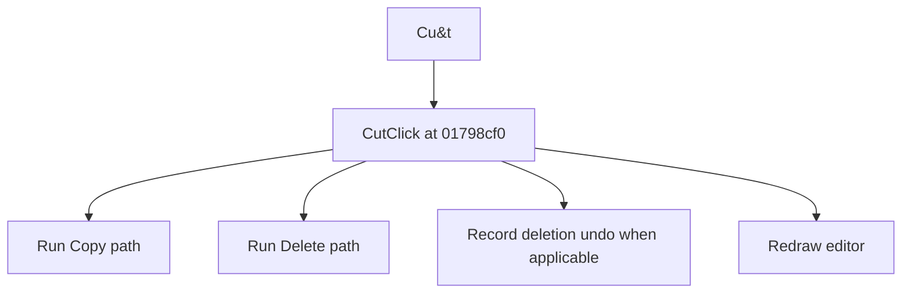

# Cu&t

> Analysis status: Source reviewed for TIARA-diz.6.7.1524.

## Control

| Property | Recovered value |
| --- | --- |
| Form | ShapeEdit |
| Component path | ShapeEdit.MainMenu.Edit.Cut |
| Control class | TMenuItem |
| Caption | Cu&t |
| Hint | Not present in the recovered resource. |
| Handler name | CutClick |
| Handler address | 01798cf0 |
| Graph node | `resource:dfm:ShapeEdit/ShapeEdit.MainMenu.Edit.Cut` |
| Handler node | `function:01798cf0` |

## What happens when clicked

Runs the same copy handler as Copy. It then runs the delete handler, which removes eligible selected objects, marks the document dirty, records an undo command when deletion occurs, and redraws the editor. The delete call still runs after the copy handler returns, including after its serialization-failure path.

## Click flow

## Evidence

- Handler source: [0000000001798CF0__FUN_01798cf0.c](../../../DecompiledSources/Tina16/functions/0000000001798CF0__FUN_01798cf0.c)
- Extracted glyph: None.
- Recovered path: The recovered handler calls 01798d20 and then 01795980 without testing a returned success value. The two callees establish the clipboard and deletion behavior.
- Resource context: The recovered TMenuItem resource uses caption `Cu&t`.

## Analysis limits

- Copy failure does not prevent the recovered handler from continuing to Delete.
- The caption, hint, and glyph support control identity only. They do not replace the recovered handler and callee evidence.

