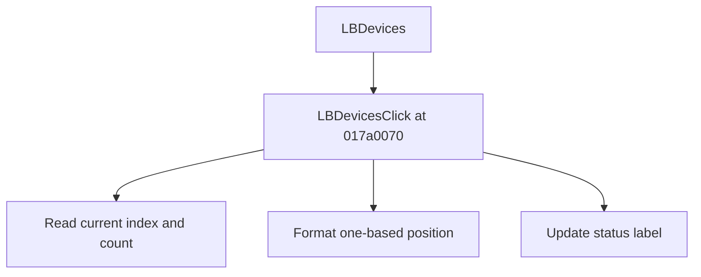

# LBDevices

> Analysis status: Source reviewed for TIARA-diz.6.7.1585.

## Control

| Property | Recovered value |
| --- | --- |
| Form | ShapeEdit |
| Component path | ShapeEdit.TemplatePanel.LBDevices |
| Control class | TListBox |
| Caption | LBDevices |
| Hint | Not present in the recovered resource. |
| Handler name | LBDevicesClick |
| Handler address | 017a0070 |
| Graph node | `resource:dfm:ShapeEdit/ShapeEdit.TemplatePanel.LBDevices` |
| Handler node | `function:017a0070` |

## What happens when clicked

Formats the current list index plus one and the total device count as “N of M devices”, then writes that text to the status label. It does not change the selected device or model data. With current index -1, it reports 0 of the current count.

## Click flow

## Evidence

- Handler source: [00000000017A0070__FUN_017a0070.c](../../../DecompiledSources/Tina16/functions/00000000017A0070__FUN_017a0070.c)
- Extracted glyph: None.
- Recovered path: The handler reads the list index and count, formats resource text with index + 1 and count, and writes only the caption field at form offset +0xa68.
- Resource context: The recovered TListBox resource uses caption `LBDevices`.

## Analysis limits

- No additional implementation gap was found in the recovered click path.
- The caption, hint, and glyph support control identity only. They do not replace the recovered handler and callee evidence.

