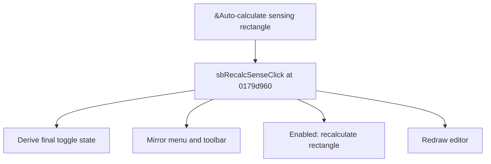

# &Auto-calculate sensing rectangle

> Analysis status: Source reviewed for TIARA-diz.6.7.1527.

## Control

| Property | Recovered value |
| --- | --- |
| Form | ShapeEdit |
| Component path | ShapeEdit.MainMenu.Edit.mnAutoCalculateSensingRectangle |
| Control class | TMenuItem |
| Caption | &Auto-calculate sensing rectangle |
| Hint | Not present in the recovered resource. |
| Handler name | sbRecalcSenseClick |
| Handler address | 0179d960 |
| Graph node | `resource:dfm:ShapeEdit/ShapeEdit.MainMenu.Edit.mnAutoCalculateSensingRectangle` |
| Handler node | `function:0179d960` |

## What happens when clicked

Derives the new state from the menu item or toolbar sender, mirrors that state between both controls, and recalculates the sensing rectangle only when the final state is enabled. It always redraws the editor. The calculation unions eligible non-pin object bounds and writes the result to the sensing-rectangle object when it exists.

This control shares the recovered handler with `ShapeEdit.TopToolBar.EditorTools.sbRecalcSense`. This article keeps the resource evidence for this control separate.

## Click flow

## Evidence

- Handler source: [000000000179D960__FUN_0179d960.c](../../../DecompiledSources/Tina16/functions/000000000179D960__FUN_0179d960.c)
- Extracted glyph: None.
- Recovered path: The shared handler tests Sender, updates the menu checked and toolbar down states, conditionally calls 0179d630, and invalidates the editor. 0179d630 builds bounds while excluding the recovered marker class and pins.
- Resource context: The recovered TMenuItem resource uses caption `&Auto-calculate sensing rectangle`.

## Analysis limits

- No additional implementation gap was found in the recovered click path.
- The caption, hint, and glyph support control identity only. They do not replace the recovered handler and callee evidence.

