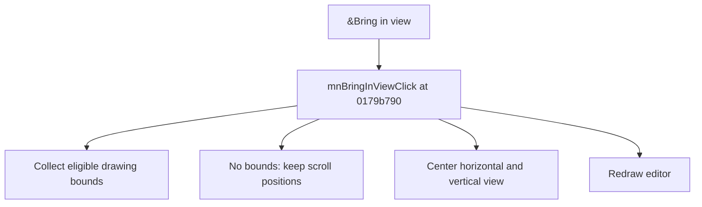

# &Bring in view

> Analysis status: Source reviewed for TIARA-diz.6.7.1549.

## Control

| Property | Recovered value |
| --- | --- |
| Form | ShapeEdit |
| Component path | ShapeEdit.MainMenu.View.mnBringInView |
| Control class | TMenuItem |
| Caption | &Bring in view |
| Hint | Not present in the recovered resource. |
| Handler name | mnBringInViewClick |
| Handler address | 0179b790 |
| Graph node | `resource:dfm:ShapeEdit/ShapeEdit.MainMenu.View.mnBringInView` |
| Handler node | `function:0179b790` |

## What happens when clicked

Computes the union bounds of eligible drawing objects, applies the current scale, and centers both scroll positions on those bounds. If no eligible object exists, it does not change the scroll positions. It redraws the editor.

This control shares the recovered handler with `ShapeEdit.TopToolBar.EditorTools.sbBringInView`. This article keeps the resource evidence for this control separate.

## Click flow

## Evidence

- Handler source: [000000000179B790__FUN_0179b790.c](../../../DecompiledSources/Tina16/functions/000000000179B790__FUN_0179b790.c)
- Extracted glyph: None.
- Recovered path: The handler skips the recovered excluded class, obtains object bounds through virtual calls, computes scaled center positions, writes the horizontal and vertical scrollbar positions, and invalidates the editor.
- Resource context: The recovered TMenuItem resource uses caption `&Bring in view`.

## Analysis limits

- No additional implementation gap was found in the recovered click path.
- The caption, hint, and glyph support control identity only. They do not replace the recovered handler and callee evidence.

