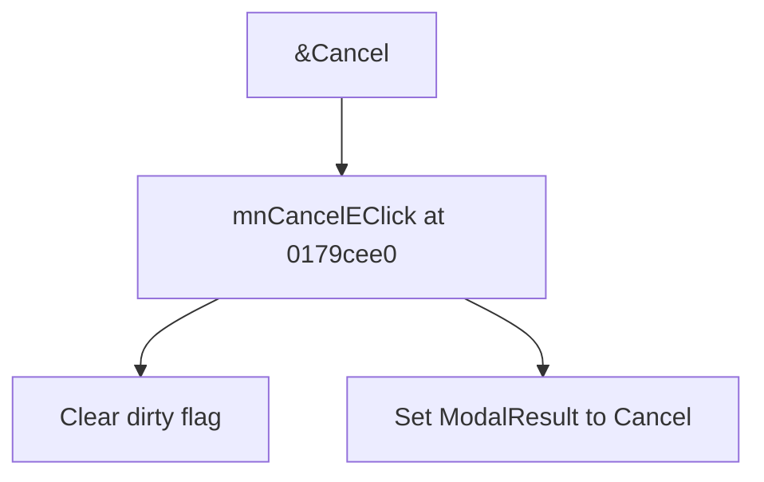

# &Cancel

> Analysis status: Source reviewed for TIARA-diz.6.7.1570.

## Control

| Property | Recovered value |
| --- | --- |
| Form | ShapeEdit |
| Component path | ShapeEdit.MainMenu.mnFileEmbedded.mnCancelE |
| Control class | TMenuItem |
| Caption | &Cancel |
| Hint | Not present in the recovered resource. |
| Handler name | mnCancelEClick |
| Handler address | 0179cee0 |
| Graph node | `resource:dfm:ShapeEdit/ShapeEdit.MainMenu.mnFileEmbedded.mnCancelE` |
| Handler node | `function:0179cee0` |

## What happens when clicked

Clears the ShapeEdit dirty flag and sets the form ModalResult to 2, which closes the modal editor through the Cancel result. The handler itself does not restore earlier object data.

## Click flow

## Evidence

- Handler source: [000000000179CEE0__FUN_0179cee0.c](../../../DecompiledSources/Tina16/functions/000000000179CEE0__FUN_0179cee0.c)
- Extracted glyph: None.
- Recovered path: The recovered handler calls 01795670 with 0 and writes value 2 to form field +0x508.
- Resource context: The recovered TMenuItem resource uses caption `&Cancel`.

## Analysis limits

- No rollback operation is present in this handler.
- The caption, hint, and glyph support control identity only. They do not replace the recovered handler and callee evidence.

