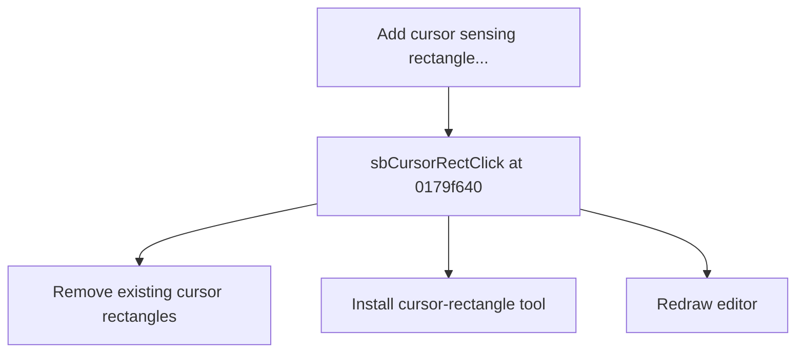

# Add cursor sensing rectangle...

> Analysis status: Source reviewed for TIARA-diz.6.7.1530.

## Control

| Property | Recovered value |
| --- | --- |
| Form | ShapeEdit |
| Component path | ShapeEdit.MainMenu.Edit.mnCursorRect |
| Control class | TMenuItem |
| Caption | Add cursor sensing rectangle... |
| Hint | Not present in the recovered resource. |
| Handler name | sbCursorRectClick |
| Handler address | 0179f640 |
| Graph node | `resource:dfm:ShapeEdit/ShapeEdit.MainMenu.Edit.mnCursorRect` |
| Handler node | `function:0179f640` |

## What happens when clicked

Removes all existing cursor-rectangle objects from the document, normalizes the list, installs a new cursor-rectangle drawing tool, and redraws the editor. This allows one replacement rectangle to be drawn.

This control shares the recovered handler with `ShapeEdit.TopToolBar.EditorTools.sbCursorRect`. This article keeps the resource evidence for this control separate.

## Click flow

## Evidence

- Handler source: [000000000179F640__FUN_0179f640.c](../../../DecompiledSources/Tina16/functions/000000000179F640__FUN_0179f640.c)
- Extracted glyph: None.
- Recovered path: The handler identifies objects by class 017ad080, removes and destroys them, calls 01794b80 with a new 00c5ed90 tool object, and invalidates the editor.
- Resource context: The recovered TMenuItem resource uses caption `Add cursor sensing rectangle...`.

## Analysis limits

- No additional implementation gap was found in the recovered click path.
- The caption, hint, and glyph support control identity only. They do not replace the recovered handler and callee evidence.

