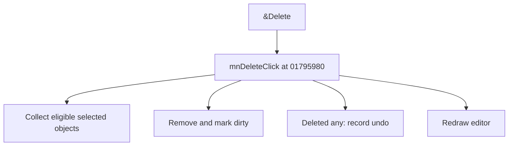

# &Delete

> Analysis status: Source reviewed for TIARA-diz.6.7.1531.

## Control

| Property | Recovered value |
| --- | --- |
| Form | ShapeEdit |
| Component path | ShapeEdit.MainMenu.Edit.mnDelete |
| Control class | TMenuItem |
| Caption | &Delete |
| Hint | Not present in the recovered resource. |
| Handler name | mnDeleteClick |
| Handler address | 01795980 |
| Graph node | `resource:dfm:ShapeEdit/ShapeEdit.MainMenu.Edit.mnDelete` |
| Handler node | `function:01795980` |

## What happens when clicked

Collects selected objects except the protected recovered class, removes the eligible objects, and marks the document dirty. If at least one object was deleted, it creates an undo command. It normalizes the list and redraws even when nothing is deleted.

## Click flow

## Evidence

- Handler source: [0000000001795980__FUN_01795980.c](../../../DecompiledSources/Tina16/functions/0000000001795980__FUN_01795980.c)
- Extracted glyph: None.
- Recovered path: The handler tests selection byte +0x21 and class 017aad48, removes eligible entries from field +0xd10, calls 01795670 with 1, pushes a 00c5c340 command when the temporary list is non-empty, and invalidates the editor.
- Resource context: The recovered TMenuItem resource uses caption `&Delete`.

## Analysis limits

- No additional implementation gap was found in the recovered click path.
- The caption, hint, and glyph support control identity only. They do not replace the recovered handler and callee evidence.

