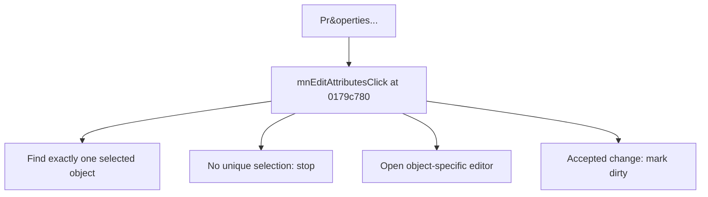

# Pr&operties...

> Analysis status: Source reviewed for TIARA-diz.6.7.1532.

## Control

| Property | Recovered value |
| --- | --- |
| Form | ShapeEdit |
| Component path | ShapeEdit.MainMenu.Edit.mnEditAttributes |
| Control class | TMenuItem |
| Caption | Pr&operties... |
| Hint | Not present in the recovered resource. |
| Handler name | mnEditAttributesClick |
| Handler address | 0179c780 |
| Graph node | `resource:dfm:ShapeEdit/ShapeEdit.MainMenu.Edit.mnEditAttributes` |
| Handler node | `function:0179c780` |

## What happens when clicked

Finds exactly one selected object. If none or more than one object is selected, it does nothing. For one object, it invokes that object's virtual attribute editor and marks the document dirty only when the editor reports an accepted change.

## Click flow

## Evidence

- Handler source: [000000000179C780__FUN_0179c780.c](../../../DecompiledSources/Tina16/functions/000000000179C780__FUN_0179c780.c)
- Extracted glyph: None.
- Recovered path: 0179c7c0 returns one selected object or null when selection is ambiguous. The handler invokes the recovered virtual edit method and calls 01795670 with 1 only on its true result.
- Resource context: The recovered TMenuItem resource uses caption `Pr&operties...`.

## Analysis limits

- The concrete dialog depends on the selected object's class and is dispatched through a virtual method.
- The caption, hint, and glyph support control identity only. They do not replace the recovered handler and callee evidence.

