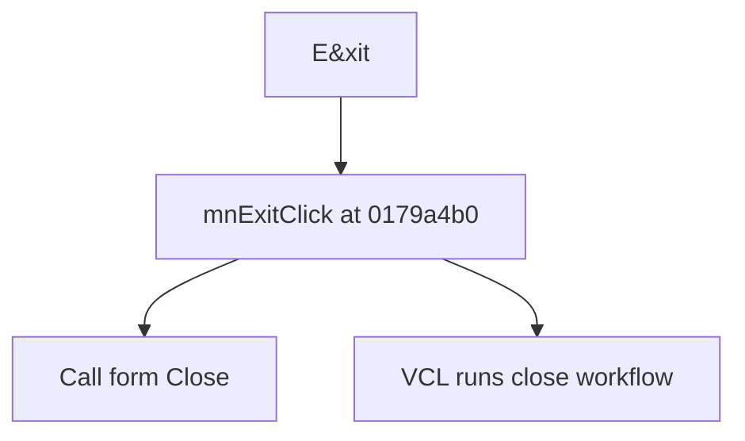

# E&xit

> Analysis status: Source reviewed for TIARA-diz.6.7.1567.

## Control

| Property | Recovered value |
| --- | --- |
| Form | ShapeEdit |
| Component path | ShapeEdit.MainMenu.mnFile.mnExit |
| Control class | TMenuItem |
| Caption | E&xit |
| Hint | Not present in the recovered resource. |
| Handler name | mnExitClick |
| Handler address | 0179a4b0 |
| Graph node | `resource:dfm:ShapeEdit/ShapeEdit.MainMenu.mnFile.mnExit` |
| Handler node | `function:0179a4b0` |

## What happens when clicked

Calls the Delphi form Close method. The form's close workflow, including any close-query or unsaved-change handling, runs outside this handler.

## Click flow

## Evidence

- Handler source: [000000000179A4B0__FUN_0179a4b0.c](../../../DecompiledSources/Tina16/functions/000000000179A4B0__FUN_0179a4b0.c)
- Extracted glyph: None.
- Recovered path: The recovered click handler consists of a call to the canonical TCustomForm.Close implementation with the ShapeEdit form as receiver.
- Resource context: The recovered TMenuItem resource uses caption `E&xit`.

## Analysis limits

- Any close-query decision is not present in this click handler.
- The caption, hint, and glyph support control identity only. They do not replace the recovered handler and callee evidence.

