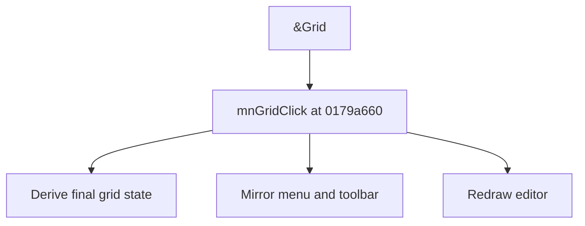

# &Grid

> Analysis status: Source reviewed for TIARA-diz.6.7.1550.

## Control

| Property | Recovered value |
| --- | --- |
| Form | ShapeEdit |
| Component path | ShapeEdit.MainMenu.View.mnGrid |
| Control class | TMenuItem |
| Caption | &Grid |
| Hint | Not present in the recovered resource. |
| Handler name | mnGridClick |
| Handler address | 0179a660 |
| Graph node | `resource:dfm:ShapeEdit/ShapeEdit.MainMenu.View.mnGrid` |
| Handler node | `function:0179a660` |

## What happens when clicked

Derives the final grid state from the menu item or toolbar sender, mirrors the state between the menu checked property and toolbar down property, and redraws the editor.

This control shares the recovered handler with `ShapeEdit.TopToolBar.EditorTools.sbGrid`. This article keeps the resource evidence for this control separate.

## Click flow

## Evidence

- Handler source: [000000000179A660__FUN_0179a660.c](../../../DecompiledSources/Tina16/functions/000000000179A660__FUN_0179a660.c)
- Extracted glyph: None.
- Recovered path: The shared handler tests Sender, reads or toggles the menu state, calls the recovered checked/down setters for fields +0x6c0 and +0x8d0, and invalidates the editor.
- Resource context: The recovered TMenuItem resource uses caption `&Grid`.

## Analysis limits

- No additional implementation gap was found in the recovered click path.
- The caption, hint, and glyph support control identity only. They do not replace the recovered handler and callee evidence.

