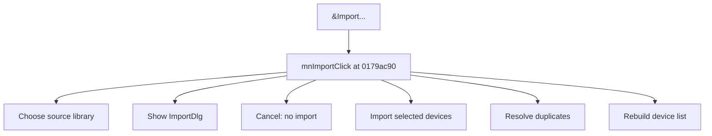

# &Import...

> Analysis status: Source reviewed for TIARA-diz.6.7.1568.

## Control

| Property | Recovered value |
| --- | --- |
| Form | ShapeEdit |
| Component path | ShapeEdit.MainMenu.mnFile.mnImport |
| Control class | TMenuItem |
| Caption | &Import... |
| Hint | Not present in the recovered resource. |
| Handler name | mnImportClick |
| Handler address | 0179ac90 |
| Graph node | `resource:dfm:ShapeEdit/ShapeEdit.MainMenu.mnFile.mnImport` |
| Handler node | `function:0179ac90` |

## What happens when clicked

Shows the import file dialog and stops on cancel. It loads the source library, opens ImportDlg with no devices selected, and imports the selected rows after OK. New names are added. Duplicate names use the overwrite, alternate, or stop choice from the import dialog. Each accepted mutation marks the document dirty. Earlier accepted changes remain if a later duplicate stops the loop. The visible device list and selection are rebuilt after the import path.

This control shares the recovered handler with `ShapeEdit.MainMenu.mnFileEmbedded.mnImportE`. This article keeps the resource evidence for this control separate.

## Click flow

## Evidence

- Handler source: [000000000179AC90__FUN_0179ac90.c](../../../DecompiledSources/Tina16/functions/000000000179AC90__FUN_0179ac90.c)
- Extracted glyph: None.
- Recovered path: The handler checks both modal dialogs, loads TSM files through a special branch or other libraries through the normal loader, populates ImportDlg, iterates selected source devices, branches on duplicate-name results, calls the add or replace paths, calls 01795670 with 1 after accepted changes, and refreshes the device list.
- Resource context: The recovered TMenuItem resource uses caption `&Import...`.

## Analysis limits

- The import is not transactional; stopping on a later duplicate does not roll back earlier accepted devices.
- The caption, hint, and glyph support control identity only. They do not replace the recovered handler and callee evidence.

