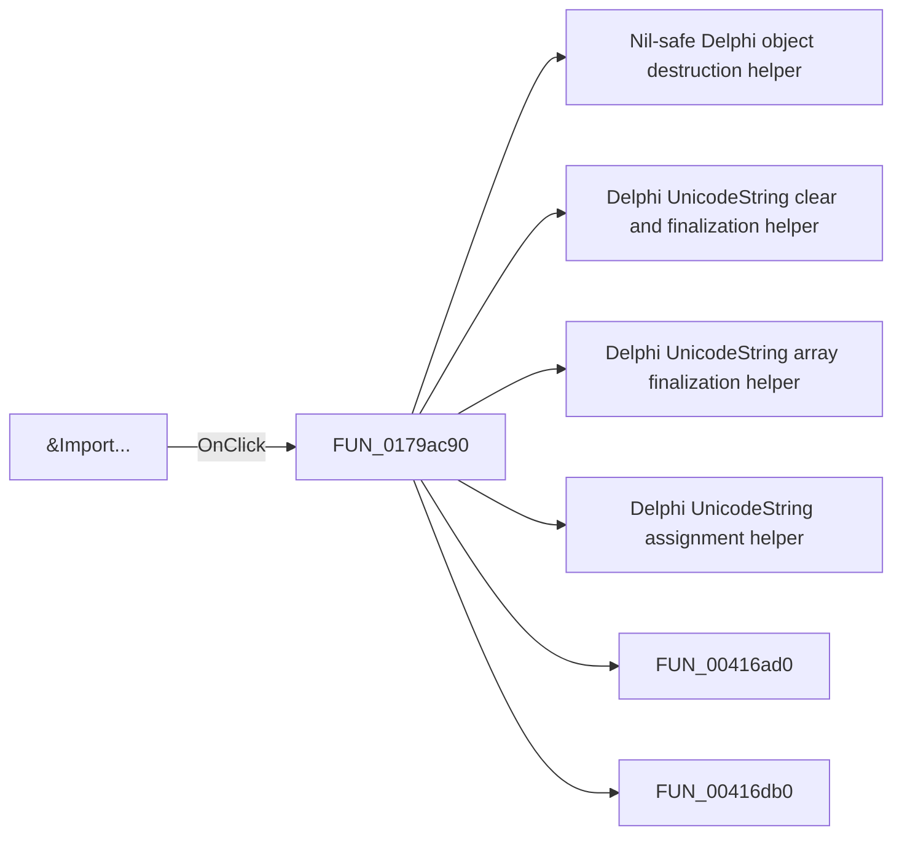

# &Import...

> Analysis status: Pending individual source review.

## Control

| Property | Recovered value |
| --- | --- |
| Form | ShapeEdit |
| Component path | ShapeEdit.MainMenu.mnFileEmbedded.mnImportE |
| Control class | TMenuItem |
| Caption | &Import... |
| Hint | Not present in the recovered resource. |
| Text | Not present in the recovered resource. |
| Handler name | mnImportClick |
| Handler address | 0179ac90 |
| Graph node | `resource:dfm:ShapeEdit/ShapeEdit.MainMenu.mnFileEmbedded.mnImportE` |
| Handler node | `function:0179ac90` |
| Graph layer | UI |

## What happens when clicked

Pending individual analysis. An agent must read the recovered handler source and its relevant callees before it replaces this text.

## Click flow

## Handler evidence

- Source: [DecompiledSources/Tina16/functions/000000000179AC90__FUN_0179ac90.c](../../../DecompiledSources/Tina16/functions/000000000179AC90__FUN_0179ac90.c)
- Recovered role: Not present in the recovered resource.
- Current graph summary: Handles 2 Delphi UI events: ShapeEdit.MainMenu.mnFileEmbedded.mnImportE.OnClick, ShapeEdit.MainMenu.mnFile.mnImport.OnClick.
- Current graph behavior: Not present in the recovered resource.
- Current graph evidence: Not present in the recovered resource.
- Complexity: complex
- Distinct outgoing calls: 34

## Direct calls

- `function:00410f20` — Nil-safe Delphi object destruction helper
- `function:00414480` — Delphi UnicodeString clear and finalization helper
- `function:00414560` — Delphi UnicodeString array finalization helper
- `function:00414ad0` — Delphi UnicodeString assignment helper
- `function:00416ad0` — FUN_00416ad0
- `function:00416db0` — FUN_00416db0
- `function:0043e130` — FUN_0043e130
- `function:00441920` — FUN_00441920
- `function:00441a10` — FUN_00441a10
- `function:00442f70` — FUN_00442f70
- `function:004b3260` — FUN_004b3260
- `function:004b3390` — FUN_004b3390
- `function:004b67b0` — FUN_004b67b0
- `function:004b6930` — FUN_004b6930
- `function:0064dd90` — VCL control Unicode text reader
- `function:0064de00` — VCL control text setter with change suppression
- `function:0068bca0` — FUN_0068bca0
- `function:0068bd10` — FUN_0068bd10
- `function:00724270` — FUN_00724270
- `function:0072d440` — FUN_0072d440
- `function:007fc180` — FUN_007fc180
- `function:00c3f320` — FUN_00c3f320
- `function:00c3f350` — FUN_00c3f350
- `function:0177d560` — FUN_0177d560
- `function:01782e70` — Handles 1 Delphi UI event: ImportDlg.btnNone.OnClick.
- `function:017832e0` — Handles 1 Delphi UI event: ImportDlg.edSearch.OnExit.
- `function:01794150` — FUN_01794150
- `function:01795670` — FUN_01795670
- `function:017960f0` — FUN_017960f0
- `function:01798270` — FUN_01798270
- `function:0179a870` — FUN_0179a870
- `function:0179bb80` — FUN_0179bb80
- `function:0179bc20` — FUN_0179bc20
- `function:0179bc60` — FUN_0179bc60

## Resource evidence

- Kind: Not present in the recovered resource.
- Modal result: Not present in the recovered resource.
- Checked state: Not present in the recovered resource.
- List items: Not present in the recovered resource.
- Image reference: Not present in the recovered resource.
- Extracted glyph: None.

## Nearby label candidates

Nearby labels are layout candidates only. They are not proof of behavior.

- No same-parent label candidate is available.

## Analysis limits

- Do not infer behavior from the control class, caption, hint, glyph, or nearby label alone.
- Do not replace the pending status until the handler source and relevant call path provide enough evidence.
