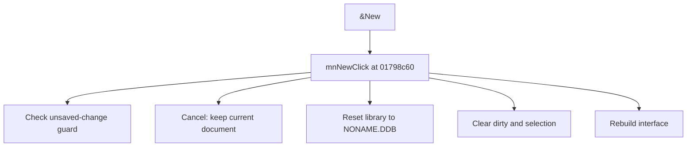

# &New

> Analysis status: Source reviewed for TIARA-diz.6.7.1569.

## Control

| Property | Recovered value |
| --- | --- |
| Form | ShapeEdit |
| Component path | ShapeEdit.MainMenu.mnFile.mnNew |
| Control class | TMenuItem |
| Caption | &New |
| Hint | Not present in the recovered resource. |
| Handler name | mnNewClick |
| Handler address | 01798c60 |
| Graph node | `resource:dfm:ShapeEdit/ShapeEdit.MainMenu.mnFile.mnNew` |
| Handler node | `function:01798c60` |

## What happens when clicked

Runs the unsaved-change guard. When it allows the operation, it changes the filename to NONAME.DDB, resets the current library and editing state, clears the dirty flag, rebuilds the device list, clears the current selection, updates the interface, and clears the sort checkbox state. Cancel in the guard leaves the current document unchanged.

## Click flow

## Evidence

- Handler source: [0000000001798C60__FUN_01798c60.c](../../../DecompiledSources/Tina16/functions/0000000001798C60__FUN_01798c60.c)
- Extracted glyph: None.
- Recovered path: The handler calls 01798ba0. That helper calls 01795d10, checks its result, stores NONAME.DDB, resets the library through 01794150 and 017941c0, clears dirty state, rebuilds and clears selection, updates UI state, and unchecks field +0xc38.
- Resource context: The recovered TMenuItem resource uses caption `&New`.

## Analysis limits

- No additional implementation gap was found in the recovered click path.
- The caption, hint, and glyph support control identity only. They do not replace the recovered handler and callee evidence.

