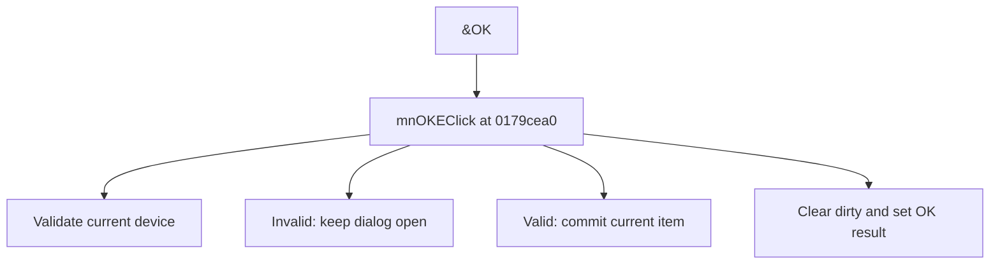

# &OK

> Analysis status: Source reviewed for TIARA-diz.6.7.1572.

## Control

| Property | Recovered value |
| --- | --- |
| Form | ShapeEdit |
| Component path | ShapeEdit.MainMenu.mnFileEmbedded.mnOKE |
| Control class | TMenuItem |
| Caption | &OK |
| Hint | Not present in the recovered resource. |
| Handler name | mnOKEClick |
| Handler address | 0179cea0 |
| Graph node | `resource:dfm:ShapeEdit/ShapeEdit.MainMenu.mnFileEmbedded.mnOKE` |
| Handler node | `function:0179cea0` |

## What happens when clicked

Validates the current device. On validation failure, it shows the recovered device-check message and keeps the dialog open. On success, it commits the current item to the library, clears the dirty flag, and sets ModalResult to 1.

This control shares the recovered handler with `ShapeEdit.TopToolBar.GeneralTools.sbOKE`. This article keeps the resource evidence for this control separate.

## Click flow

## Evidence

- Handler source: [000000000179CEA0__FUN_0179cea0.c](../../../DecompiledSources/Tina16/functions/000000000179CEA0__FUN_0179cea0.c)
- Extracted glyph: None.
- Recovered path: The handler calls 0179d460 and branches on its result. The true branch calls 01797060 with field +0xca0, clears dirty state, and writes value 1 to form field +0x508.
- Resource context: The recovered TMenuItem resource uses caption `&OK`.

## Analysis limits

- No additional implementation gap was found in the recovered click path.
- The caption, hint, and glyph support control identity only. They do not replace the recovered handler and callee evidence.

