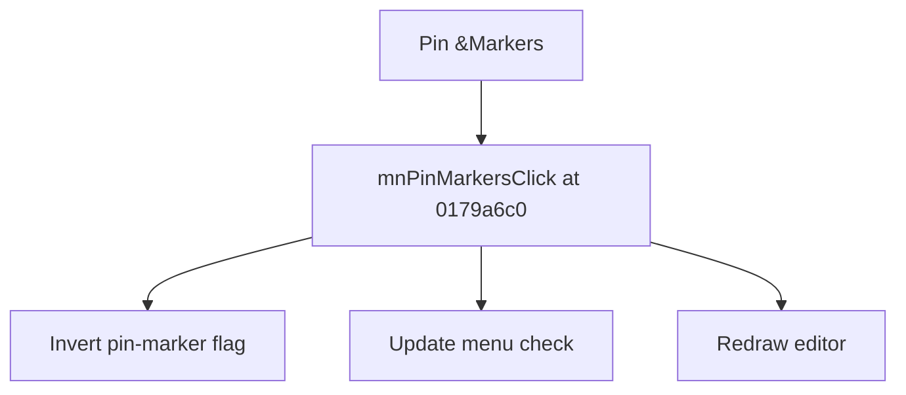

# Pin &Markers

> Analysis status: Source reviewed for TIARA-diz.6.7.1551.

## Control

| Property | Recovered value |
| --- | --- |
| Form | ShapeEdit |
| Component path | ShapeEdit.MainMenu.View.mnPinMarkers |
| Control class | TMenuItem |
| Caption | Pin &Markers |
| Hint | Not present in the recovered resource. |
| Handler name | mnPinMarkersClick |
| Handler address | 0179a6c0 |
| Graph node | `resource:dfm:ShapeEdit/ShapeEdit.MainMenu.View.mnPinMarkers` |
| Handler node | `function:0179a6c0` |

## What happens when clicked

Toggles the global pin-marker flag, mirrors it to the menu checked state, and redraws the editor.

## Click flow

## Evidence

- Handler source: [000000000179A6C0__FUN_0179a6c0.c](../../../DecompiledSources/Tina16/functions/000000000179A6C0__FUN_0179a6c0.c)
- Extracted glyph: None.
- Recovered path: The handler inverts the byte at PTR_DAT_020010e0, updates menu field +0x8d8, and invalidates the editor.
- Resource context: The recovered TMenuItem resource uses caption `Pin &Markers`.

## Analysis limits

- No additional implementation gap was found in the recovered click path.
- The caption, hint, and glyph support control identity only. They do not replace the recovered handler and callee evidence.

