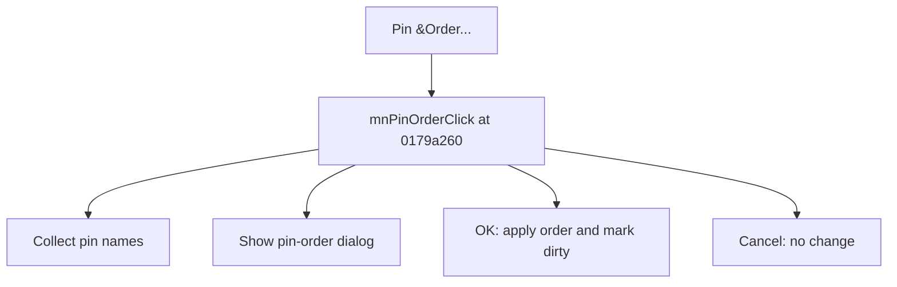

# Pin &Order...

> Analysis status: Source reviewed for TIARA-diz.6.7.1533.

## Control

| Property | Recovered value |
| --- | --- |
| Form | ShapeEdit |
| Component path | ShapeEdit.MainMenu.Edit.mnPinOrder |
| Control class | TMenuItem |
| Caption | Pin &Order... |
| Hint | Not present in the recovered resource. |
| Handler name | mnPinOrderClick |
| Handler address | 0179a260 |
| Graph node | `resource:dfm:ShapeEdit/ShapeEdit.MainMenu.Edit.mnPinOrder` |
| Handler node | `function:0179a260` |

## What happens when clicked

Builds a modal pin-order list from all pin objects, using each pin name or a numbered fallback. On OK, it writes the order selected in the dialog back to the pins and marks the document dirty. Cancel leaves the order unchanged.

## Click flow

## Evidence

- Handler source: [000000000179A260__FUN_0179a260.c](../../../DecompiledSources/Tina16/functions/000000000179A260__FUN_0179a260.c)
- Extracted glyph: None.
- Recovered path: The handler filters class 017a79c0, populates the recovered PinOrder dialog, checks its modal result, updates each pin index from the dialog mapping, and calls 01795670 with 1 on the accepted path.
- Resource context: The recovered TMenuItem resource uses caption `Pin &Order...`.

## Analysis limits

- No additional implementation gap was found in the recovered click path.
- The caption, hint, and glyph support control identity only. They do not replace the recovered handler and callee evidence.

