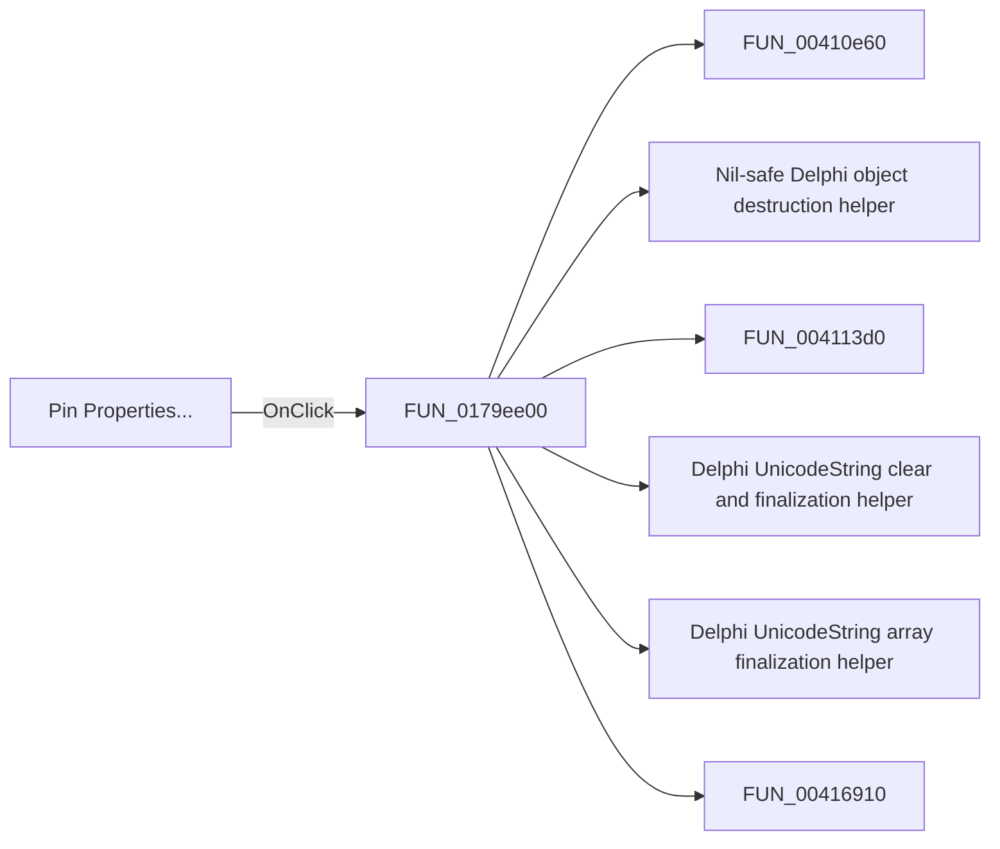

# Pin Properties...

> Analysis status: Pending individual source review.

## Control

| Property | Recovered value |
| --- | --- |
| Form | ShapeEdit |
| Component path | ShapeEdit.MainMenu.Edit.mnPinProperties |
| Control class | TMenuItem |
| Caption | Pin Properties... |
| Hint | Not present in the recovered resource. |
| Text | Not present in the recovered resource. |
| Handler name | mnPinPropertiesClick |
| Handler address | 0179ee00 |
| Graph node | `resource:dfm:ShapeEdit/ShapeEdit.MainMenu.Edit.mnPinProperties` |
| Handler node | `function:0179ee00` |
| Graph layer | UI |

## What happens when clicked

Pending individual analysis. An agent must read the recovered handler source and its relevant callees before it replaces this text.

## Click flow

## Handler evidence

- Source: [DecompiledSources/Tina16/functions/000000000179EE00__FUN_0179ee00.c](../../../DecompiledSources/Tina16/functions/000000000179EE00__FUN_0179ee00.c)
- Recovered role: Not present in the recovered resource.
- Current graph summary: Handles 1 Delphi UI event: ShapeEdit.MainMenu.Edit.mnPinProperties.OnClick.
- Current graph behavior: Not present in the recovered resource.
- Current graph evidence: Not present in the recovered resource.
- Complexity: complex
- Distinct outgoing calls: 20

## Direct calls

- `function:00410e60` — FUN_00410e60
- `function:00410f20` — Nil-safe Delphi object destruction helper
- `function:004113d0` — FUN_004113d0
- `function:00414480` — Delphi UnicodeString clear and finalization helper
- `function:00414560` — Delphi UnicodeString array finalization helper
- `function:00416910` — FUN_00416910
- `function:004169a0` — FUN_004169a0
- `function:00448450` — FUN_00448450
- `function:00448650` — FUN_00448650
- `function:004ae7e0` — FUN_004ae7e0
- `function:004aeac0` — FUN_004aeac0
- `function:00594f90` — FUN_00594f90
- `function:00597de0` — FUN_00597de0
- `function:00848a70` — FUN_00848a70
- `function:0084e320` — FUN_0084e320
- `function:0084e3e0` — FUN_0084e3e0
- `function:00c5c340` — FUN_00c5c340
- `function:00c5c790` — FUN_00c5c790
- `function:017880a0` — FUN_017880a0
- `function:017a0190` — FUN_017a0190

## Resource evidence

- Kind: Not present in the recovered resource.
- Modal result: Not present in the recovered resource.
- Checked state: Not present in the recovered resource.
- List items: Not present in the recovered resource.
- Image reference: Not present in the recovered resource.
- Extracted glyph: None.

## Nearby label candidates

Nearby labels are layout candidates only. They are not proof of behavior.

- No same-parent label candidate is available.

## Analysis limits

- Do not infer behavior from the control class, caption, hint, glyph, or nearby label alone.
- Do not replace the pending status until the handler source and relevant call path provide enough evidence.
