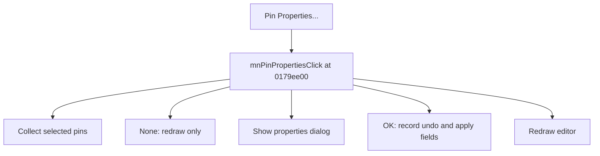

# Pin Properties...

> Analysis status: Source reviewed for TIARA-diz.6.7.1534.

## Control

| Property | Recovered value |
| --- | --- |
| Form | ShapeEdit |
| Component path | ShapeEdit.MainMenu.Edit.mnPinProperties |
| Control class | TMenuItem |
| Caption | Pin Properties... |
| Hint | Not present in the recovered resource. |
| Handler name | mnPinPropertiesClick |
| Handler address | 0179ee00 |
| Graph node | `resource:dfm:ShapeEdit/ShapeEdit.MainMenu.Edit.mnPinProperties` |
| Handler node | `function:0179ee00` |

## What happens when clicked

Collects selected pin objects. With no selected pin, it only redraws. Otherwise it shows the pin-properties dialog. On OK, it records undo state and copies the edited property fields back to each selected pin, then runs the pin post-update path and redraws. Cancel does not copy changes.

## Click flow

## Evidence

- Handler source: [000000000179EE00__FUN_0179ee00.c](../../../DecompiledSources/Tina16/functions/000000000179EE00__FUN_0179ee00.c)
- Extracted glyph: None.
- Recovered path: The handler filters selected objects to class 017a79c0, populates rows in dialog 01785938, checks ModalResult, creates a 00c5c340 command, copies row fields to each pin, calls 017a0190, and invalidates the editor.
- Resource context: The recovered TMenuItem resource uses caption `Pin Properties...`.

## Analysis limits

- The recovered handler does not call the direct dirty-flag setter; any dirty-state effect can only occur in the called update or undo paths.
- The caption, hint, and glyph support control identity only. They do not replace the recovered handler and callee evidence.

