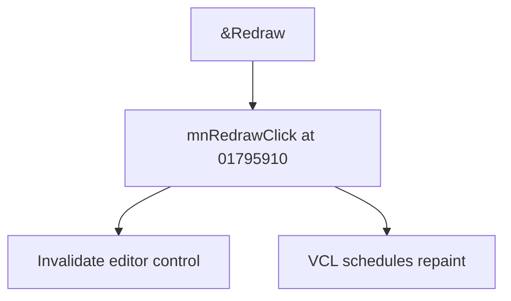

# &Redraw

> Analysis status: Source reviewed for TIARA-diz.6.7.1552.

## Control

| Property | Recovered value |
| --- | --- |
| Form | ShapeEdit |
| Component path | ShapeEdit.MainMenu.View.mnRedraw |
| Control class | TMenuItem |
| Caption | &Redraw |
| Hint | Not present in the recovered resource. |
| Handler name | mnRedrawClick |
| Handler address | 01795910 |
| Graph node | `resource:dfm:ShapeEdit/ShapeEdit.MainMenu.View.mnRedraw` |
| Handler node | `function:01795910` |

## What happens when clicked

Invalidates the ShapeEdit canvas or editor control so that it is repainted. It does not change document data.

## Click flow

## Evidence

- Handler source: [0000000001795910__FUN_01795910.c](../../../DecompiledSources/Tina16/functions/0000000001795910__FUN_01795910.c)
- Extracted glyph: None.
- Recovered path: The handler contains one call to 0064e770 with form field +0x948 and then returns.
- Resource context: The recovered TMenuItem resource uses caption `&Redraw`.

## Analysis limits

- No additional implementation gap was found in the recovered click path.
- The caption, hint, and glyph support control identity only. They do not replace the recovered handler and callee evidence.

