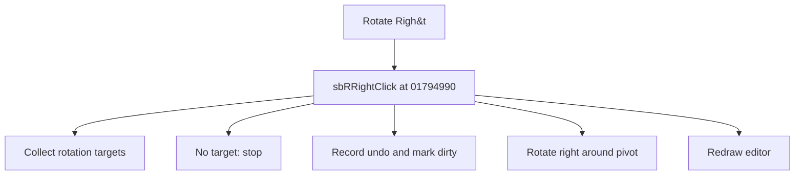

# Rotate Righ&t

> Analysis status: Source reviewed for TIARA-diz.6.7.1537.

## Control

| Property | Recovered value |
| --- | --- |
| Form | ShapeEdit |
| Component path | ShapeEdit.MainMenu.Edit.mnRotateRight |
| Control class | TMenuItem |
| Caption | Rotate Righ&t |
| Hint | Not present in the recovered resource. |
| Handler name | sbRRightClick |
| Handler address | 01794990 |
| Graph node | `resource:dfm:ShapeEdit/ShapeEdit.MainMenu.Edit.mnRotateRight` |
| Handler node | `function:01794990` |

## What happens when clicked

Collects selected objects, or the temporary objects while an active interaction tool is present. It records undo state for normal document objects, marks the document dirty, invokes each object's right-rotation virtual method around the derived pivot, and redraws. With no eligible object, it exits without a transform.

This control shares the recovered handler with `ShapeEdit.TopToolBar.EditorTools.sbRRight`. This article keeps the resource evidence for this control separate.

## Click flow

## Evidence

- Handler source: [0000000001794990__FUN_01794990.c](../../../DecompiledSources/Tina16/functions/0000000001794990__FUN_01794990.c)
- Extracted glyph: None.
- Recovered path: The handler calls 017946f0 with direction flag 0. That helper gathers the target list, derives a pivot, creates an undo command for normal objects, calls virtual slot +0x68, sets the dirty flag, and invalidates the editor.
- Resource context: The recovered TMenuItem resource uses caption `Rotate Righ&t`.

## Analysis limits

- No additional implementation gap was found in the recovered click path.
- The caption, hint, and glyph support control identity only. They do not replace the recovered handler and callee evidence.

