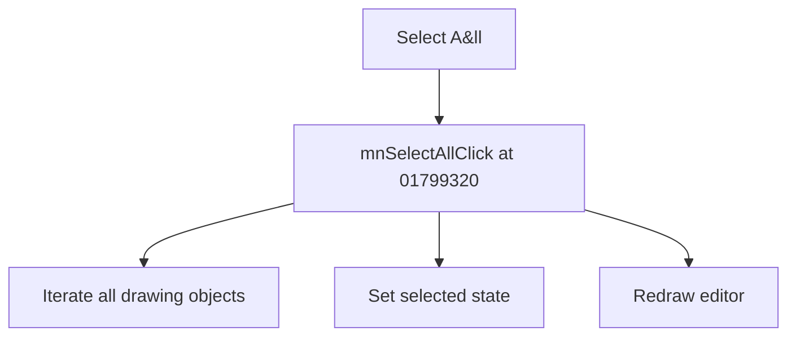

# Select A&ll

> Analysis status: Source reviewed for TIARA-diz.6.7.1538.

## Control

| Property | Recovered value |
| --- | --- |
| Form | ShapeEdit |
| Component path | ShapeEdit.MainMenu.Edit.mnSelectAll |
| Control class | TMenuItem |
| Caption | Select A&ll |
| Hint | Not present in the recovered resource. |
| Handler name | mnSelectAllClick |
| Handler address | 01799320 |
| Graph node | `resource:dfm:ShapeEdit/ShapeEdit.MainMenu.Edit.mnSelectAll` |
| Handler node | `function:01799320` |

## What happens when clicked

Iterates through every drawing object, sets its selected flag, and redraws the editor. An empty list causes only the redraw.

## Click flow

## Evidence

- Handler source: [0000000001799320__FUN_01799320.c](../../../DecompiledSources/Tina16/functions/0000000001799320__FUN_01799320.c)
- Extracted glyph: None.
- Recovered path: The handler loops over field +0xd10, calls 017afd00 with value 1 for each object, and invalidates the editor.
- Resource context: The recovered TMenuItem resource uses caption `Select A&ll`.

## Analysis limits

- No additional implementation gap was found in the recovered click path.
- The caption, hint, and glyph support control identity only. They do not replace the recovered handler and callee evidence.

