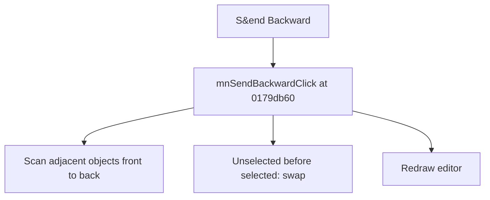

# S&end Backward

> Analysis status: Source reviewed for TIARA-diz.6.7.1539.

## Control

| Property | Recovered value |
| --- | --- |
| Form | ShapeEdit |
| Component path | ShapeEdit.MainMenu.Edit.mnSendBackward |
| Control class | TMenuItem |
| Caption | S&end Backward |
| Hint | Not present in the recovered resource. |
| Handler name | mnSendBackwardClick |
| Handler address | 0179db60 |
| Graph node | `resource:dfm:ShapeEdit/ShapeEdit.MainMenu.Edit.mnSendBackward` |
| Handler node | `function:0179db60` |

## What happens when clicked

Scans the drawing list from front to back. When a selected object has an unselected object immediately before it, the handler swaps the pair. Each eligible selected object moves backward by one layer, and the editor is redrawn.

## Click flow

## Evidence

- Handler source: [000000000179DB60__FUN_0179db60.c](../../../DecompiledSources/Tina16/functions/000000000179DB60__FUN_0179db60.c)
- Extracted glyph: None.
- Recovered path: The handler reads selection byte +0x21 for adjacent entries, calls the list exchange method for unselected/selected pairs, then invalidates the editor.
- Resource context: The recovered TMenuItem resource uses caption `S&end Backward`.

## Analysis limits

- No additional implementation gap was found in the recovered click path.
- The caption, hint, and glyph support control identity only. They do not replace the recovered handler and callee evidence.

