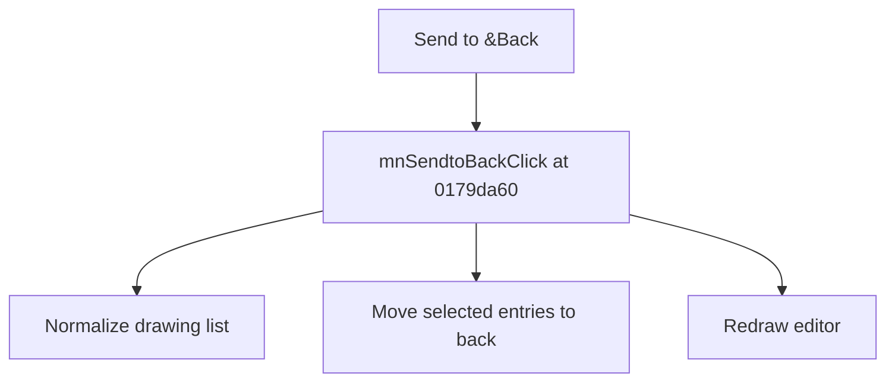

# Send to &Back

> Analysis status: Source reviewed for TIARA-diz.6.7.1540.

## Control

| Property | Recovered value |
| --- | --- |
| Form | ShapeEdit |
| Component path | ShapeEdit.MainMenu.Edit.mnSendtoBack |
| Control class | TMenuItem |
| Caption | Send to &Back |
| Hint | Not present in the recovered resource. |
| Handler name | mnSendtoBackClick |
| Handler address | 0179da60 |
| Graph node | `resource:dfm:ShapeEdit/ShapeEdit.MainMenu.Edit.mnSendtoBack` |
| Handler node | `function:0179da60` |

## What happens when clicked

Normalizes the drawing list, scans it from the start, and moves selected objects to back positions while preserving their relative order. It then redraws the editor.

## Click flow

## Evidence

- Handler source: [000000000179DA60__FUN_0179da60.c](../../../DecompiledSources/Tina16/functions/000000000179DA60__FUN_0179da60.c)
- Extracted glyph: None.
- Recovered path: The handler tests selection byte +0x21, moves selected list entries to ascending start indexes, normalizes the list, and invalidates the editor.
- Resource context: The recovered TMenuItem resource uses caption `Send to &Back`.

## Analysis limits

- No additional implementation gap was found in the recovered click path.
- The caption, hint, and glyph support control identity only. They do not replace the recovered handler and callee evidence.

