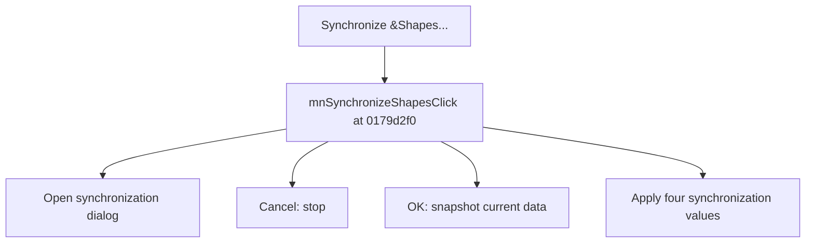

# Synchronize &Shapes...

> Analysis status: Source reviewed for TIARA-diz.6.7.1541.

## Control

| Property | Recovered value |
| --- | --- |
| Form | ShapeEdit |
| Component path | ShapeEdit.MainMenu.Edit.mnSynchronizeShapes |
| Control class | TMenuItem |
| Caption | Synchronize &Shapes... |
| Hint | Not present in the recovered resource. |
| Handler name | mnSynchronizeShapesClick |
| Handler address | 0179d2f0 |
| Graph node | `resource:dfm:ShapeEdit/ShapeEdit.MainMenu.Edit.mnSynchronizeShapes` |
| Handler node | `function:0179d2f0` |

## What happens when clicked

Creates a synchronization dialog from the current device data. On OK, it snapshots the current editor data and passes the dialog's four recovered values, with the current device index, to the synchronization update path. Cancel makes no call to that update path.

## Click flow

## Evidence

- Handler source: [000000000179D2F0__FUN_0179d2f0.c](../../../DecompiledSources/Tina16/functions/000000000179D2F0__FUN_0179d2f0.c)
- Extracted glyph: None.
- Recovered path: The handler constructs dialog class 01783a88, checks ModalResult 1, calls 00c3f030 to load a snapshot, reads four dialog fields, and calls 00c3f250.
- Resource context: The recovered TMenuItem resource uses caption `Synchronize &Shapes...`.

## Analysis limits

- The recovered field names for the four synchronization values are unavailable, so their individual meanings remain unknown.
- The caption, hint, and glyph support control identity only. They do not replace the recovered handler and callee evidence.

