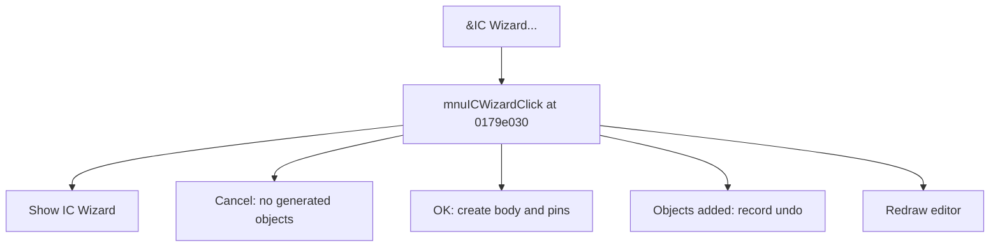

# &IC Wizard...

> Analysis status: Source reviewed for TIARA-diz.6.7.1558.

## Control

| Property | Recovered value |
| --- | --- |
| Form | ShapeEdit |
| Component path | ShapeEdit.MainMenu.mnDraw.mnuICWizard |
| Control class | TMenuItem |
| Caption | &IC Wizard... |
| Hint | Not present in the recovered resource. |
| Handler name | mnuICWizardClick |
| Handler address | 0179e030 |
| Graph node | `resource:dfm:ShapeEdit/ShapeEdit.MainMenu.mnDraw.mnuICWizard` |
| Handler node | `function:0179e030` |

## What happens when clicked

Shows the IC Wizard for the current library context. Cancel adds nothing. On OK, it creates the IC body and the configured pins, appends the generated objects to the drawing list, records an undo command when objects were added, and redraws the editor.

## Click flow

## Evidence

- Handler source: [000000000179E030__FUN_0179e030.c](../../../DecompiledSources/Tina16/functions/000000000179E030__FUN_0179e030.c)
- Extracted glyph: None.
- Recovered path: The handler constructs dialog class 01784028, checks its modal result, computes the body geometry, creates body and pin objects from wizard lists and settings, adds them to field +0xd10, conditionally pushes a 00c5c340 command, and invalidates the editor.
- Resource context: The recovered TMenuItem resource uses caption `&IC Wizard...`.

## Analysis limits

- The handler has no direct call to the ShapeEdit dirty-flag setter; any dirty-state effect is not established here.
- The caption, hint, and glyph support control identity only. They do not replace the recovered handler and callee evidence.

