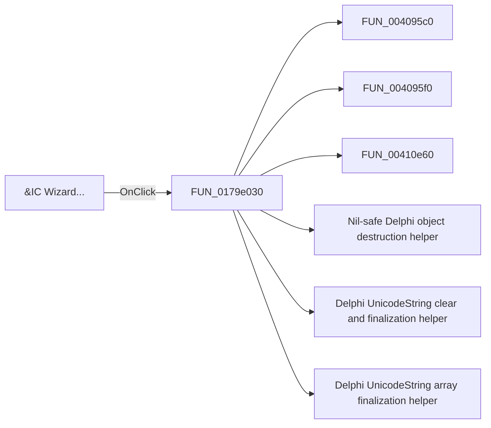

# &IC Wizard...

> Analysis status: Pending individual source review.

## Control

| Property | Recovered value |
| --- | --- |
| Form | ShapeEdit |
| Component path | ShapeEdit.MainMenu.mnDraw.mnuICWizard |
| Control class | TMenuItem |
| Caption | &IC Wizard... |
| Hint | Not present in the recovered resource. |
| Text | Not present in the recovered resource. |
| Handler name | mnuICWizardClick |
| Handler address | 0179e030 |
| Graph node | `resource:dfm:ShapeEdit/ShapeEdit.MainMenu.mnDraw.mnuICWizard` |
| Handler node | `function:0179e030` |
| Graph layer | UI |

## What happens when clicked

Pending individual analysis. An agent must read the recovered handler source and its relevant callees before it replaces this text.

## Click flow

## Handler evidence

- Source: [DecompiledSources/Tina16/functions/000000000179E030__FUN_0179e030.c](../../../DecompiledSources/Tina16/functions/000000000179E030__FUN_0179e030.c)
- Recovered role: Not present in the recovered resource.
- Current graph summary: Handles 1 Delphi UI event: ShapeEdit.MainMenu.mnDraw.mnuICWizard.OnClick.
- Current graph behavior: Not present in the recovered resource.
- Current graph evidence: Not present in the recovered resource.
- Complexity: complex
- Distinct outgoing calls: 24

## Direct calls

- `function:004095c0` — FUN_004095c0
- `function:004095f0` — FUN_004095f0
- `function:00410e60` — FUN_00410e60
- `function:00410f20` — Nil-safe Delphi object destruction helper
- `function:00414480` — Delphi UnicodeString clear and finalization helper
- `function:00414560` — Delphi UnicodeString array finalization helper
- `function:0043f750` — FUN_0043f750
- `function:00498310` — FUN_00498310
- `function:004ae7e0` — FUN_004ae7e0
- `function:004aeac0` — FUN_004aeac0
- `function:005fdaa0` — FUN_005fdaa0
- `function:005fdab0` — FUN_005fdab0
- `function:00b95b20` — FUN_00b95b20
- `function:00c5c340` — FUN_00c5c340
- `function:00c5c790` — FUN_00c5c790
- `function:00f04d50` — FUN_00f04d50
- `function:01784b90` — FUN_01784b90
- `function:01799a70` — FUN_01799a70
- `function:01799b40` — FUN_01799b40
- `function:0179b960` — FUN_0179b960
- `function:0179b9f0` — FUN_0179b9f0
- `function:0179bb00` — FUN_0179bb00
- `function:017ad290` — FUN_017ad290
- `function:017b02a0` — FUN_017b02a0

## Resource evidence

- Kind: Not present in the recovered resource.
- Modal result: Not present in the recovered resource.
- Checked state: Not present in the recovered resource.
- List items: Not present in the recovered resource.
- Image reference: Not present in the recovered resource.
- Extracted glyph: None.

## Nearby label candidates

Nearby labels are layout candidates only. They are not proof of behavior.

- No same-parent label candidate is available.

## Analysis limits

- Do not infer behavior from the control class, caption, hint, glyph, or nearby label alone.
- Do not replace the pending status until the handler source and relevant call path provide enough evidence.
