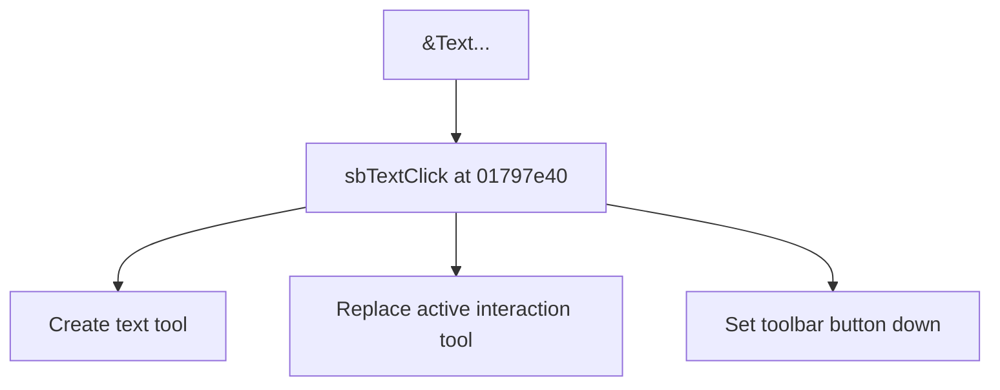

# &Text...

> Analysis status: Source reviewed for TIARA-diz.6.7.1562.

## Control

| Property | Recovered value |
| --- | --- |
| Form | ShapeEdit |
| Component path | ShapeEdit.MainMenu.mnDraw.mnuText |
| Control class | TMenuItem |
| Caption | &Text... |
| Hint | Not present in the recovered resource. |
| Handler name | sbTextClick |
| Handler address | 01797e40 |
| Graph node | `resource:dfm:ShapeEdit/ShapeEdit.MainMenu.mnDraw.mnuText` |
| Handler node | `function:01797e40` |

## What happens when clicked

Creates the recovered text tool object, installs it as the active ShapeEdit interaction tool, and sets the corresponding toolbar button down. A previous active tool is released by the shared installation path.

This control shares the recovered handler with `ShapeEdit.TopToolBar.EditorTools.sbText`. This article keeps the resource evidence for this control separate.

## Click flow

## Evidence

- Handler source: [0000000001797E40__FUN_01797e40.c](../../../DecompiledSources/Tina16/functions/0000000001797E40__FUN_01797e40.c)
- Extracted glyph: None.
- Recovered path: The handler constructs the text tool class, calls 01794b80 to replace field +0xd20, and updates the recovered speed-button state.
- Resource context: The recovered TMenuItem resource uses caption `&Text...`.

## Analysis limits

- No additional implementation gap was found in the recovered click path.
- The caption, hint, and glyph support control identity only. They do not replace the recovered handler and callee evidence.

