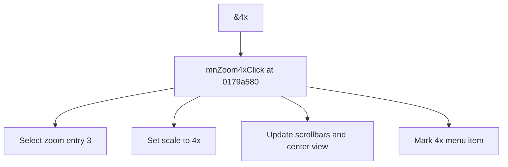

# &4x

> Analysis status: Source reviewed for TIARA-diz.6.7.1547.

## Control

| Property | Recovered value |
| --- | --- |
| Form | ShapeEdit |
| Component path | ShapeEdit.MainMenu.View.Zoom.mnZoom4x |
| Control class | TMenuItem |
| Caption | &4x |
| Hint | Not present in the recovered resource. |
| Handler name | mnZoom4xClick |
| Handler address | 0179a580 |
| Graph node | `resource:dfm:ShapeEdit/ShapeEdit.MainMenu.View.Zoom.mnZoom4x` |
| Handler node | `function:0179a580` |

## What happens when clicked

Selects zoom entry 3, maps it to scale factor 4, updates both scrollbar ranges and increments, recenters the drawing in view, and updates the checked zoom menu item.

## Click flow

## Evidence

- Handler source: [000000000179A580__FUN_0179a580.c](../../../DecompiledSources/Tina16/functions/000000000179A580__FUN_0179a580.c)
- Extracted glyph: None.
- Recovered path: The click handler selects entry 3 on field +0x710 and calls 017949a0. That helper maps entries 0 through 3 to 1 through 4 and entry 4 to 8, updates viewport ranges, calls the bring-in-view path, and mirrors the menu checks.
- Resource context: The recovered TMenuItem resource uses caption `&4x`.

## Analysis limits

- No additional implementation gap was found in the recovered click path.
- The caption, hint, and glyph support control identity only. They do not replace the recovered handler and callee evidence.

