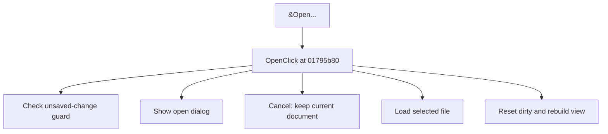

# &Open...

> Analysis status: Source reviewed for TIARA-diz.6.7.1564.

## Control

| Property | Recovered value |
| --- | --- |
| Form | ShapeEdit |
| Component path | ShapeEdit.MainMenu.mnFile.Open |
| Control class | TMenuItem |
| Caption | &Open... |
| Hint | Not present in the recovered resource. |
| Handler name | OpenClick |
| Handler address | 01795b80 |
| Graph node | `resource:dfm:ShapeEdit/ShapeEdit.MainMenu.mnFile.Open` |
| Handler node | `function:01795b80` |

## What happens when clicked

Runs the unsaved-change guard. If it allows the operation, it shows the open dialog. On file selection, it loads the chosen library, clears the dirty flag, stores the filename, rebuilds and clears the visible selection, updates the interface, and redraws. Cancel at either guard or dialog leaves the current file loaded.

This control shares the recovered handler with `ShapeEdit.TopToolBar.GeneralTools.sbOpen`. This article keeps the resource evidence for this control separate.

## Click flow

## Evidence

- Handler source: [0000000001795B80__FUN_01795b80.c](../../../DecompiledSources/Tina16/functions/0000000001795B80__FUN_01795b80.c)
- Extracted glyph: None.
- Recovered path: The handler calls 01795d10, checks the open-dialog result, calls 017960f0 with the chosen path, calls 01795670 with 0, stores field +0xc98, and runs the recovered list, selection, UI, and redraw helpers.
- Resource context: The recovered TMenuItem resource uses caption `&Open...`.

## Analysis limits

- No additional implementation gap was found in the recovered click path.
- The caption, hint, and glyph support control identity only. They do not replace the recovered handler and callee evidence.

