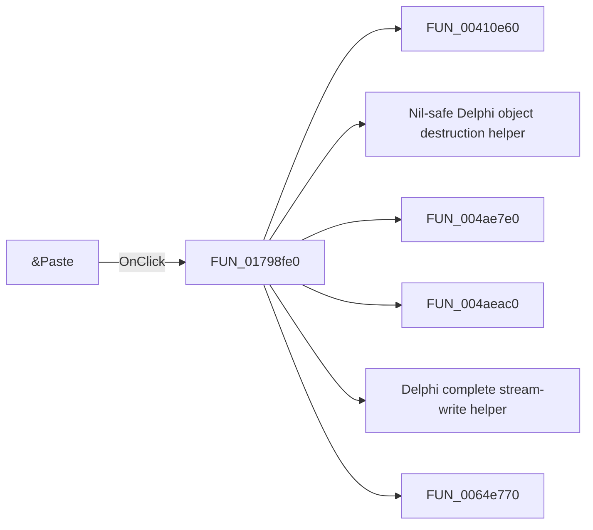

# &Paste

> Analysis status: Pending individual source review.

## Control

| Property | Recovered value |
| --- | --- |
| Form | ShapeEdit |
| Component path | ShapeEdit.MainMenu.Edit.Paste |
| Control class | TMenuItem |
| Caption | &Paste |
| Hint | Not present in the recovered resource. |
| Text | Not present in the recovered resource. |
| Handler name | PasteClick |
| Handler address | 01798fe0 |
| Graph node | `resource:dfm:ShapeEdit/ShapeEdit.MainMenu.Edit.Paste` |
| Handler node | `function:01798fe0` |
| Graph layer | UI |

## What happens when clicked

Pending individual analysis. An agent must read the recovered handler source and its relevant callees before it replaces this text.

## Click flow

## Handler evidence

- Source: [DecompiledSources/Tina16/functions/0000000001798FE0__FUN_01798fe0.c](../../../DecompiledSources/Tina16/functions/0000000001798FE0__FUN_01798fe0.c)
- Recovered role: Not present in the recovered resource.
- Current graph summary: Handles 2 Delphi UI events: ShapeEdit.TopToolBar.GeneralTools.sbPaste.OnClick, ShapeEdit.MainMenu.Edit.Paste.OnClick.
- Current graph behavior: Not present in the recovered resource.
- Current graph evidence: Not present in the recovered resource.
- Complexity: complex
- Distinct outgoing calls: 17

## Direct calls

- `function:00410e60` — FUN_00410e60
- `function:00410f20` — Nil-safe Delphi object destruction helper
- `function:004ae7e0` — FUN_004ae7e0
- `function:004aeac0` — FUN_004aeac0
- `function:004b89e0` — Delphi complete stream-write helper
- `function:0064e770` — FUN_0064e770
- `function:006a5da0` — FUN_006a5da0
- `function:006a5ff0` — FUN_006a5ff0
- `function:006a6030` — FUN_006a6030
- `function:00c5c340` — FUN_00c5c340
- `function:00c5c790` — FUN_00c5c790
- `function:01795670` — FUN_01795670
- `function:017956f0` — FUN_017956f0
- `function:017967b0` — FUN_017967b0
- `function:01799300` — FUN_01799300
- `function:01d30b30` — FUN_01d30b30
- `function:01d331a0` — FUN_01d331a0

## Resource evidence

- Kind: Not present in the recovered resource.
- Modal result: Not present in the recovered resource.
- Checked state: Not present in the recovered resource.
- List items: Not present in the recovered resource.
- Image reference: Not present in the recovered resource.
- Extracted glyph: None.

## Nearby label candidates

Nearby labels are layout candidates only. They are not proof of behavior.

- No same-parent label candidate is available.

## Analysis limits

- Do not infer behavior from the control class, caption, hint, glyph, or nearby label alone.
- Do not replace the pending status until the handler source and relevant call path provide enough evidence.
