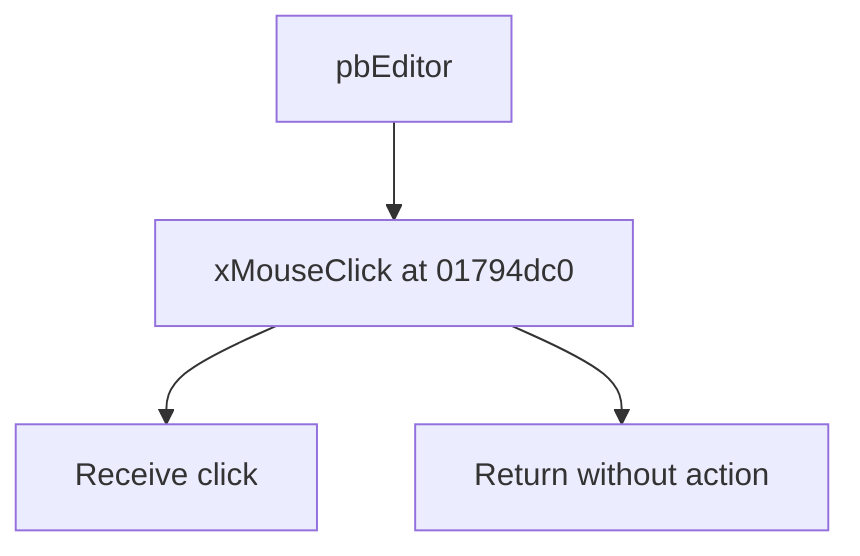

# pbEditor

> Analysis status: Source reviewed for TIARA-diz.6.7.1608.

## Control

| Property | Recovered value |
| --- | --- |
| Form | ShapeEdit |
| Component path | ShapeEdit.scbEditor.pbEditor |
| Control class | TPaintBox |
| Caption | pbEditor |
| Hint | Not present in the recovered resource. |
| Handler name | xMouseClick |
| Handler address | 01794dc0 |
| Graph node | `resource:dfm:ShapeEdit/ShapeEdit.scbEditor.pbEditor` |
| Handler node | `function:01794dc0` |

## What happens when clicked

Returns immediately. It performs no call, branch, state write, or redraw.

## Click flow

## Evidence

- Handler source: [0000000001794DC0__FUN_01794dc0.c](../../../DecompiledSources/Tina16/functions/0000000001794DC0__FUN_01794dc0.c)
- Extracted glyph: None.
- Recovered path: The recovered function at 01794dc0 contains one return instruction, and the graph has no outgoing call from it.
- Resource context: The recovered TPaintBox resource uses caption `pbEditor`.

## Analysis limits

- No additional implementation gap was found in the recovered click path.
- The caption, hint, and glyph support control identity only. They do not replace the recovered handler and callee evidence.

