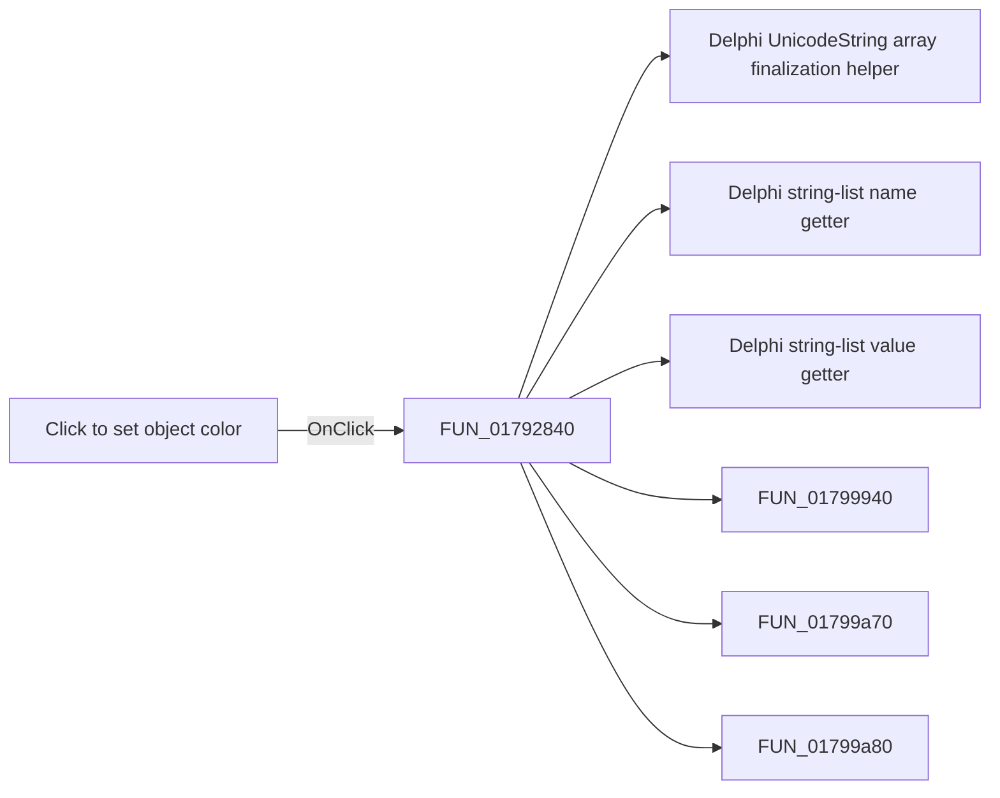

# Click to set object color

> Analysis status: Pending individual source review.

## Control

| Property | Recovered value |
| --- | --- |
| Form | ShapeEdit |
| Component path | ShapeEdit.PartsPanel.pnlOC.pbOC |
| Control class | TPaintBox |
| Caption | Not present in the recovered resource. |
| Hint | Click to set object color |
| Text | Not present in the recovered resource. |
| Handler name | pbOCClick |
| Handler address | 01792840 |
| Graph node | `resource:dfm:ShapeEdit/ShapeEdit.PartsPanel.pnlOC.pbOC` |
| Handler node | `function:01792840` |
| Graph layer | UI |

## What happens when clicked

Pending individual analysis. An agent must read the recovered handler source and its relevant callees before it replaces this text.

## Click flow

## Handler evidence

- Source: [DecompiledSources/Tina16/functions/0000000001792840__FUN_01792840.c](../../../DecompiledSources/Tina16/functions/0000000001792840__FUN_01792840.c)
- Recovered role: Not present in the recovered resource.
- Current graph summary: Handles 1 Delphi UI event: ShapeEdit.PartsPanel.pnlOC.pbOC.OnClick.
- Current graph behavior: Not present in the recovered resource.
- Current graph evidence: Not present in the recovered resource.
- Complexity: complex
- Distinct outgoing calls: 6

## Direct calls

- `function:00414560` — Delphi UnicodeString array finalization helper
- `function:004b3cf0` — Delphi string-list name getter
- `function:004b5390` — Delphi string-list value getter
- `function:01799940` — FUN_01799940
- `function:01799a70` — FUN_01799a70
- `function:01799a80` — FUN_01799a80

## Resource evidence

- Kind: Not present in the recovered resource.
- Modal result: Not present in the recovered resource.
- Checked state: Not present in the recovered resource.
- List items: Not present in the recovered resource.
- Image reference: Not present in the recovered resource.
- Extracted glyph: None.

## Nearby label candidates

Nearby labels are layout candidates only. They are not proof of behavior.

- No same-parent label candidate is available.

## Analysis limits

- Do not infer behavior from the control class, caption, hint, glyph, or nearby label alone.
- Do not replace the pending status until the handler source and relevant call path provide enough evidence.
