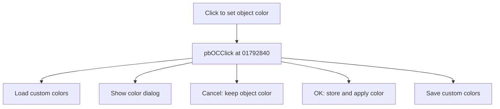

# Click to set object color

> Analysis status: Source reviewed for TIARA-diz.6.7.1583.

## Control

| Property | Recovered value |
| --- | --- |
| Form | ShapeEdit |
| Component path | ShapeEdit.PartsPanel.pnlOC.pbOC |
| Control class | TPaintBox |
| Caption | Click to set object color |
| Hint | Click to set object color |
| Handler name | pbOCClick |
| Handler address | 01792840 |
| Graph node | `resource:dfm:ShapeEdit/ShapeEdit.PartsPanel.pnlOC.pbOC` |
| Handler node | `function:01792840` |

## What happens when clicked

Loads saved custom colors into the color dialog and initializes it from the current object color. Cancel leaves the object color unchanged. On OK, it stores the chosen color, applies it to the selected objects, records undo state, marks the document dirty, refreshes the editor, and saves the dialog's custom colors back to settings.

## Click flow

## Evidence

- Handler source: [0000000001792840__FUN_01792840.c](../../../DecompiledSources/Tina16/functions/0000000001792840__FUN_01792840.c)
- Extracted glyph: None.
- Recovered path: The handler copies custom-color settings into the dialog, calls 01799a70 for the current color, checks the modal result, calls 01799a80 with the chosen value, calls 01799940 to apply the color to selected objects, and writes each custom color back to settings. 01799940 records selected objects, marks dirty, invokes their color-update method, and refreshes.
- Resource context: The recovered TPaintBox resource uses caption `Click to set object color` and hint `Click to set object color`.

## Analysis limits

- No additional implementation gap was found in the recovered click path.
- The caption, hint, and glyph support control identity only. They do not replace the recovered handler and callee evidence.

