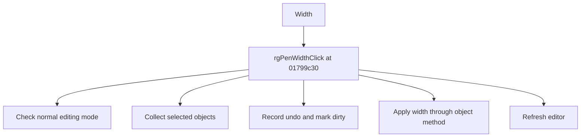

#  Width 

> Analysis status: Source reviewed for TIARA-diz.6.7.1584.

## Control

| Property | Recovered value |
| --- | --- |
| Form | ShapeEdit |
| Component path | ShapeEdit.PartsPanel.rgPenWidth |
| Control class | TRadioGroup |
| Caption |  Width  |
| Hint | Border width |
| Handler name | rgPenWidthClick |
| Handler address | 01799c30 |
| Graph node | `resource:dfm:ShapeEdit/ShapeEdit.PartsPanel.rgPenWidth` |
| Handler node | `function:01799c30` |

## What happens when clicked

In normal editing mode, collects selected objects, marks the document dirty, records undo state when any object is selected, invokes each selected object's style-update path using the form's current width choice, and refreshes the editor. In embedded mode, it does nothing.

## Click flow

## Evidence

- Handler source: [0000000001799C30__FUN_01799c30.c](../../../DecompiledSources/Tina16/functions/0000000001799C30__FUN_01799c30.c)
- Extracted glyph: None.
- Recovered path: The handler guards on form byte +0xc93, gathers objects with selection byte +0x21, calls 01795670 with 1 for each, conditionally pushes a 00c5c340 command, invokes virtual slot +0x20 on each selected object, and refreshes field +0x948.
- Resource context: The recovered TRadioGroup resource uses caption ` Width ` and hint `Border width`.

## Analysis limits

- The radio group supplies the selected width, but the recovered virtual object method hides class-specific storage details.
- The caption, hint, and glyph support control identity only. They do not replace the recovered handler and callee evidence.

