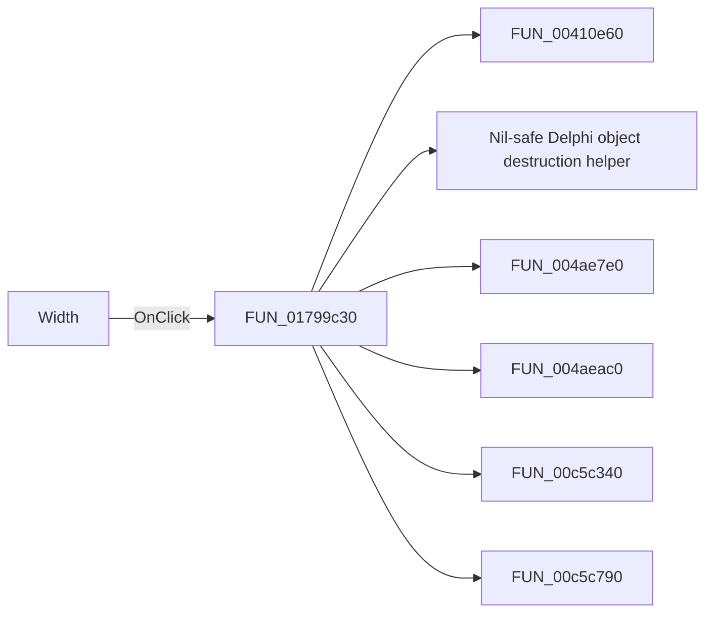

#  Width

> Analysis status: Pending individual source review.

## Control

| Property | Recovered value |
| --- | --- |
| Form | ShapeEdit |
| Component path | ShapeEdit.PartsPanel.rgPenWidth |
| Control class | TRadioGroup |
| Caption |  Width  |
| Hint | Border width |
| Text | Not present in the recovered resource. |
| Handler name | rgPenWidthClick |
| Handler address | 01799c30 |
| Graph node | `resource:dfm:ShapeEdit/ShapeEdit.PartsPanel.rgPenWidth` |
| Handler node | `function:01799c30` |
| Graph layer | UI |

## What happens when clicked

Pending individual analysis. An agent must read the recovered handler source and its relevant callees before it replaces this text.

## Click flow

## Handler evidence

- Source: [DecompiledSources/Tina16/functions/0000000001799C30__FUN_01799c30.c](../../../DecompiledSources/Tina16/functions/0000000001799C30__FUN_01799c30.c)
- Recovered role: Not present in the recovered resource.
- Current graph summary: Handles 1 Delphi UI event: ShapeEdit.PartsPanel.rgPenWidth.OnClick.
- Current graph behavior: Not present in the recovered resource.
- Current graph evidence: Not present in the recovered resource.
- Complexity: complex
- Distinct outgoing calls: 7

## Direct calls

- `function:00410e60` — FUN_00410e60
- `function:00410f20` — Nil-safe Delphi object destruction helper
- `function:004ae7e0` — FUN_004ae7e0
- `function:004aeac0` — FUN_004aeac0
- `function:00c5c340` — FUN_00c5c340
- `function:00c5c790` — FUN_00c5c790
- `function:01795670` — FUN_01795670

## Resource evidence

- Kind: Not present in the recovered resource.
- Modal result: Not present in the recovered resource.
- Checked state: Not present in the recovered resource.
- List items: ("Hair", "1", "2", "3")
- Image reference: Not present in the recovered resource.
- Extracted glyph: None.

## Nearby label candidates

Nearby labels are layout candidates only. They are not proof of behavior.

- Rank 1: Object color at distance 78.
- Rank 2: Fill color at distance 136.

## Analysis limits

- Do not infer behavior from the control class, caption, hint, glyph, or nearby label alone.
- Do not replace the pending status until the handler source and relevant call path provide enough evidence.
