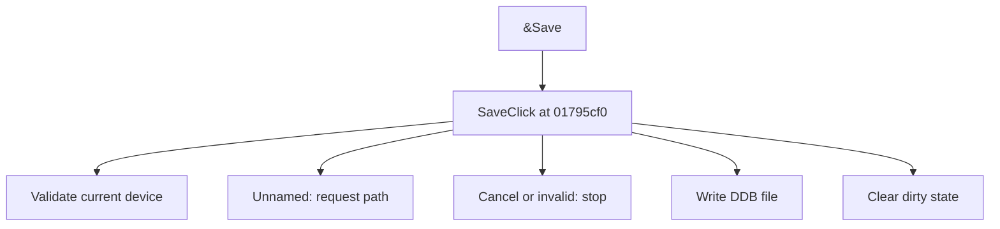

# &Save

> Analysis status: Source reviewed for TIARA-diz.6.7.1565.

## Control

| Property | Recovered value |
| --- | --- |
| Form | ShapeEdit |
| Component path | ShapeEdit.MainMenu.mnFile.Save |
| Control class | TMenuItem |
| Caption | &Save |
| Hint | Not present in the recovered resource. |
| Handler name | SaveClick |
| Handler address | 01795cf0 |
| Graph node | `resource:dfm:ShapeEdit/ShapeEdit.MainMenu.mnFile.Save` |
| Handler node | `function:01795cf0` |

## What happens when clicked

Validates the current device. If the current name is NONAME.DDB, it shows the save dialog; cancel stops the save. Otherwise it writes to the current path. A successful write clears the dirty flag, stores the chosen path, and updates the interface.

This control shares the recovered handler with `ShapeEdit.TopToolBar.GeneralTools.sbSave`. This article keeps the resource evidence for this control separate.

## Click flow

## Evidence

- Handler source: [0000000001795CF0__FUN_01795cf0.c](../../../DecompiledSources/Tina16/functions/0000000001795CF0__FUN_01795cf0.c)
- Extracted glyph: None.
- Recovered path: The handler calls 01795eb0 with Save As flag 0. That helper calls 0179d460, tests NONAME.DDB, conditionally shows the save dialog, calls 017963e0 to write, clears dirty state, stores the path, and updates the UI.
- Resource context: The recovered TMenuItem resource uses caption `&Save`.

## Analysis limits

- No additional implementation gap was found in the recovered click path.
- The caption, hint, and glyph support control identity only. They do not replace the recovered handler and callee evidence.

