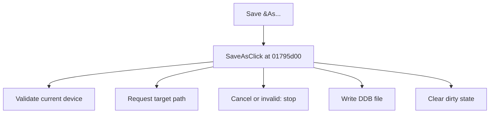

# Save &As...

> Analysis status: Source reviewed for TIARA-diz.6.7.1566.

## Control

| Property | Recovered value |
| --- | --- |
| Form | ShapeEdit |
| Component path | ShapeEdit.MainMenu.mnFile.SaveAs |
| Control class | TMenuItem |
| Caption | Save &As... |
| Hint | Not present in the recovered resource. |
| Handler name | SaveAsClick |
| Handler address | 01795d00 |
| Graph node | `resource:dfm:ShapeEdit/ShapeEdit.MainMenu.mnFile.SaveAs` |
| Handler node | `function:01795d00` |

## What happens when clicked

Validates the current device and then always shows the save dialog. Cancel or validation failure stops the operation. A successful write clears the dirty flag, stores the chosen path, and updates the interface.

## Click flow

## Evidence

- Handler source: [0000000001795D00__FUN_01795d00.c](../../../DecompiledSources/Tina16/functions/0000000001795D00__FUN_01795d00.c)
- Extracted glyph: None.
- Recovered path: The handler calls 01795eb0 with Save As flag 1. That helper calls 0179d460, shows the save dialog, calls 017963e0 to write, clears dirty state, stores the path, and updates the UI.
- Resource context: The recovered TMenuItem resource uses caption `Save &As...`.

## Analysis limits

- No additional implementation gap was found in the recovered click path.
- The caption, hint, and glyph support control identity only. They do not replace the recovered handler and callee evidence.

