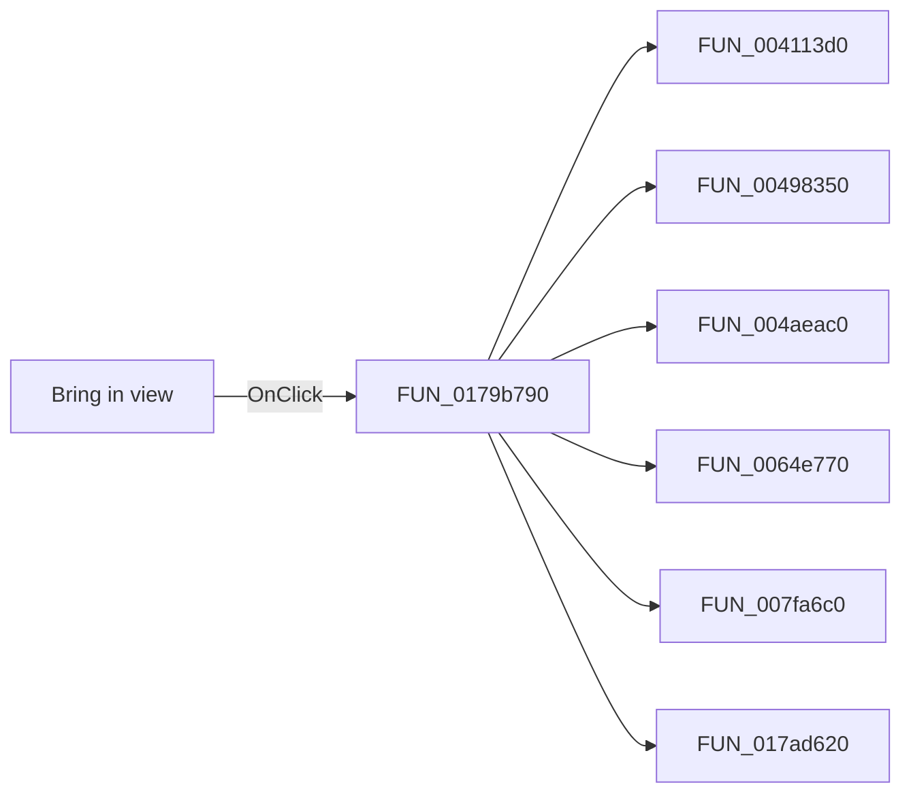

# Bring in view

> Analysis status: Pending individual source review.

## Control

| Property | Recovered value |
| --- | --- |
| Form | ShapeEdit |
| Component path | ShapeEdit.TopToolBar.EditorTools.sbBringInView |
| Control class | TSpeedButton |
| Caption | Not present in the recovered resource. |
| Hint | Bring in view |
| Text | Not present in the recovered resource. |
| Handler name | mnBringInViewClick |
| Handler address | 0179b790 |
| Graph node | `resource:dfm:ShapeEdit/ShapeEdit.TopToolBar.EditorTools.sbBringInView` |
| Handler node | `function:0179b790` |
| Graph layer | UI |

## What happens when clicked

Pending individual analysis. An agent must read the recovered handler source and its relevant callees before it replaces this text.

## Click flow

## Handler evidence

- Source: [DecompiledSources/Tina16/functions/000000000179B790__FUN_0179b790.c](../../../DecompiledSources/Tina16/functions/000000000179B790__FUN_0179b790.c)
- Recovered role: Not present in the recovered resource.
- Current graph summary: Handles 2 Delphi UI events: ShapeEdit.TopToolBar.EditorTools.sbBringInView.OnClick, ShapeEdit.MainMenu.View.mnBringInView.OnClick.
- Current graph behavior: Not present in the recovered resource.
- Current graph evidence: Not present in the recovered resource.
- Complexity: complex
- Distinct outgoing calls: 6

## Direct calls

- `function:004113d0` — FUN_004113d0
- `function:00498350` — FUN_00498350
- `function:004aeac0` — FUN_004aeac0
- `function:0064e770` — FUN_0064e770
- `function:007fa6c0` — FUN_007fa6c0
- `function:017ad620` — FUN_017ad620

## Resource evidence

- Kind: Not present in the recovered resource.
- Modal result: Not present in the recovered resource.
- Checked state: Not present in the recovered resource.
- List items: Not present in the recovered resource.
- Image reference: Not present in the recovered resource.
- Extracted glyph: [`0413_ShapeEdit_ShapeEdit_TopToolBar_EditorTools_sbBringInView_Glyph_Data.png`](../../../glyph/0413_ShapeEdit_ShapeEdit_TopToolBar_EditorTools_sbBringInView_Glyph_Data.png)

## Nearby label candidates

Nearby labels are layout candidates only. They are not proof of behavior.

- No same-parent label candidate is available.

## Analysis limits

- Do not infer behavior from the control class, caption, hint, glyph, or nearby label alone.
- Do not replace the pending status until the handler source and relevant call path provide enough evidence.
